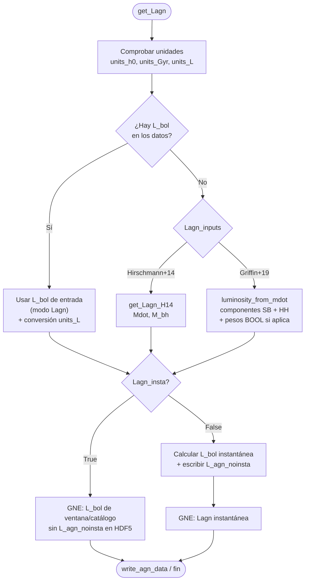

# Spec: Griffin+19 en `get_Lagn` y luminosidad bolométrica instantánea

**Repository:** [get_nebular_emission](https://github.com/galform/get_nebular_emission)  
**Issue:** [galform/get_nebular_emission#37](https://github.com/galform/get_nebular_emission/issues/37)  
**Status:** En implementación  
**Last updated:** 2026-08-25

Documentación del método Griffin elegido frente al alternativo:
[griffin-lbol-methods.md](./griffin-lbol-methods.md).

## Resumen

Integrar de forma coherente el método **Griffin+19** (con corrección super-Eddington Griffin+2020 ya en `luminosity_from_mdot`) en el cálculo de la luminosidad bolométrica del AGN (`Lagn` / `L_bol`), y formalizar el tratamiento de la **luminosidad instantánea** frente a la luminosidad de ventana temporal (`Lagn_noinsta`), con etiquetas HDF5 claras en la salida de GNE.

El código de producto ya contiene piezas parciales (`BoolLuminosityFunction.instantaneous_luminosity`, `get_Lagn_insta`, flag `Lagn_insta` en `gne.py`, modo `griffin` en `compute_Lbol_griffin`). Esta spec define el plan para unificarlas y cerrar huecos.

## Flujo lógico objetivo (`get_Lagn` + post-proceso en `gne`)

### Convenciones de modos

| Rama | `Lagn_inputs` | `Lagn_params` |
| --- | --- | --- |
| **Sí** — `L_bol` en catálogo | `Lagn` | `[columna L_bol]` (+ `units_L`) |
| **No** — calcular `L_bol` | `Hirschmann+14` | `[Mdot, M_bh]` |
| **No** — calcular `L_bol` | `Griffin+19` | `[m_bh, bh_accretion_rate_sb, bh_accretion_rate_hh, …]` + cosmología (`h0`, `omega0`, `z`, `z_prev`, `Lbox`, `tau_fold`) |

## Entrada (configuración GNE)

| Parámetro | Tipo | Descripción |
| --- | --- | --- |
| `Lagn_inputs` | `str` | `Lagn`, `Hirschmann+14` o `Griffin+19` |
| `Lagn_params` | `list` | Columnas/rutas según modo (tabla anterior) |
| `Lagn_insta` | `bool` | `True`: GNE usa luminosidad de ventana/catálogo (`Lagn_noinsta`). `False`: calcular luminosidad instantánea para líneas y conservar `Lagn_noinsta` en HDF5 |
| `Lagn_insta_params` | `list` | Parámetros para el cálculo instantáneo genérico (`r_bulge`, `v_bulge`, …) o delegación a Griffin |
| `redshift_previous` | `float` | Redshift del snapshot anterior (ventana temporal BOOL / duty cycle) |
| `tau_fold` | `float` | Factor de plegado para `t_Q` (Griffin) |

## Salida

| Dataset HDF5 | Cuándo | Label objetivo |
| --- | --- | --- |
| `agn_data/Lagn` | Siempre (AGN activo) | `L_bol (erg/s)` — valor usado por GNE para líneas y `U` |
| `agn_data/L_agn_noinsta` | Solo si `Lagn_insta=False` | `L_bol (erg/s)` integrada en la ventana entre snapshots (sin muestreo instantáneo) |

## Estado actual en el repo de producto

| Pieza | Fichero | Estado (2026-08-25) |
| --- | --- | --- |
| `get_Lbol_from_mdot`, `get_Lagn_G19` | `gne_Lagn.py` | Implementado: suma `mdot_hh+mdot_sb`, BOOL sobre `mdot_sb` |
| `get_Lagn_insta`, `_get_weights_insta_Lagn` | `gne_Lagn.py` | Implementado con `tau_fold`; fallback `delta_t=t_snapshot/10` si falta `z_prev` |
| `get_Lagn` retorno `(Lagn_noinsta, Lagn)` | `gne_Lagn.py` | Griffin+19, catálogo e Hirschmann |
| Flag `Lagn_insta` / `calculate_Lagn_insta` | `gne.py` | `True` → ventana; `False` → instantánea; omite `L_agn_noinsta` si `True` |
| `write_agn_data(..., Lagn_noinsta)` | `gne_io.py` | Bug `L_agn_noinsta` corregido; dataset solo si `Lagn_noinsta is not None` |
| Tests Griffin + instantánea | `tests/test_griffin_lagn_insta.py` | Cobertura mínima añadida |
| `gne_griffin.py` (`BoolLuminosityFunction`) | `gne_griffin.py` | Legacy; lógica BOOL integrada en `gne_Lagn.py` |

**PR de producto:** [galform/get_nebular_emission#38](https://github.com/galform/get_nebular_emission/pull/38)

## Requisitos

1. **R1 — Función de luminosidad instantánea (prioridad 1):** API única y testeada para obtener `Lagn_insta` a partir de `Lagn_noinsta`, con dos vías documentadas:
   - **Genérica (catálogo / Hirschmann):** peso `w = min(fq · t_dyn / Δt, 1)` por galaxia (vectorizado); `Δt` = edad cósmica entre `redshift_previous` y `redshift` (astropy / `gne_cosmology`), no heurística fija.
   - **Griffin (SB):** reutilizar `BoolLuminosityFunction` (`compute_sb_weights` + `instantaneous_luminosity` sobre `luminosity_from_mdot` de la componente SB); HH sin muestreo.
2. **R2 — Integración Griffin+19 en `get_Lagn`:** Unificar `griffin` y `Griffin+19` en un solo modo; `compute_Lbol_griffin` debe poder devolver `(Lagn, Lagn_noinsta)` cuando `Lagn_insta=False`.
3. **R3 — Flujo «¿Hay L_bol?»:** Rama `Lagn_inputs='Lagn'` solo cuando `L_bol` viene en datos; ramas de cálculo solo en el caso contrario.
4. **R4 — Cableado en `gne()`:** `Lagn_insta` delega en la función unificada (R1); no duplicar lógica entre `gne.py` y `gne_griffin.py`.
5. **R5 — Salida HDF5:** Corregir bug en `write_agn_data`; labels coherentes; documentar semántica de `Lagn` vs `L_agn_noinsta`.
6. **R6 — Scripts tutorial / run:** Actualizar `run_hdf5input_tutorial.py`, `run_gne_shark.py` y comentarios de configuración con los tres modos y el flag `Lagn_insta`.
7. **R7 — Tests:** Cobertura mínima en `tests/test_Lagn.py` (y/o nuevo `test_griffin_lagn.py`) para pesos instantáneos, Griffin SB/HH y escritura de `L_agn_noinsta`.

## Errores y edge cases

- Galaxias sin bulge / `t_dyn` no finito → peso 0 o `Lagn_insta = 0` (definir y testear).
- `redshift_previous` ausente con `Lagn_insta=False` → `ValueError` explícito.
- Modo Griffin sin columnas `bh_accretion_rate_sb` / `bh_accretion_rate_hh` → error claro en lectura.
- Reproducibilidad del muestreo Bernoulli: semilla configurable (opcional, default 42).

## Diseño técnico (orientativo)

- Extraer en `gne_Lagn.py` (o módulo compartido si crece) algo como `compute_instantaneous_lagn(Lagn_noinsta, method, ...)` que enrute a `_get_Lagn_insta` o a `BoolLuminosityFunction`.
- `get_Lagn` devuelve `Lagn` (siempre la luminosidad «base» de la rama); la conversión instantánea puede quedarse en `gne()` o moverse dentro de `get_Lagn` según se mantenga separación lectura/cálculo vs. post-proceso temporal (preferir un solo sitio — R4).
- Reutilizar `FlatLambdaCDM` ya usado en `BoolLuminosityFunction` para `Δt` en la vía genérica.

## Trazabilidad requisito → test

| Requisito | Test en producto |
| --- | --- |
| R1 genérica | `test_get_Lagn_insta_zeros_when_duty_cycle_weight_is_zero` |
| R1 pesos / `tau_fold` | `test_get_weights_insta_lagn_scales_with_tau_fold` |
| R2 Griffin | `test_get_Lagn_G19_without_weights_returns_window_lbol`, `test_get_Lagn_G19_with_weights_is_reproducible` |
| R3 catálogo | `test_get_Lagn_input_Lagn` (tupla) |
| R2 integración `get_Lagn` | `test_get_Lagn_griffin19_modes` (parametrizado) |
| R5 HDF5 | Pendiente test dedicado; validación manual en PR #38 |

## Plan de implementación (fases)

### Fase 1 — Función de luminosidad instantánea _(primer punto)_

1. Refactorizar `_get_Lagn_insta` / `get_Lagn_insta`:
   - Vectorizar `t_bulge(r_bulge, v_bulge)` por galaxia.
   - Calcular `delta_t_window` con cosmología (`z_prev`, `z`).
   - Aceptar `redshift_previous` como argumento obligatorio cuando `Lagn_insta=False`.
2. Revisar `BoolLuminosityFunction.instantaneous_luminosity`:
   - Documentar contrato (entrada `L_sb` en erg/s, salida instantánea).
   - Opcional: exponer también `Lagn_noinsta = L_hh + L_sb` sin muestreo.
3. Crear función unificada `compute_instantaneous_lagn(...)` que seleccione vía genérica vs Griffin según `Lagn_inputs` / contexto.
4. Tests unitarios R1 (red phase → green).

**Criterio de cierre Fase 1:** tests R1 verdes; `get_Lagn_insta` sin heurística `age/10`; sin regresión en modos con `Lagn_insta=True`.

### Fase 2 — Griffin+19 en `get_Lagn`

1. Unificar alias `griffin` → `Griffin+19` (mantener alias deprecado con warning si hace falta).
2. Completar `compute_Lbol_griffin`: spin opcional, retorno `(Lagn_insta, Lagn_noinsta)` cuando proceda.
3. Eliminar o aislar código muerto de la rama antigua `Griffin+19` → H14 en `get_Lagn`.
4. Tests R2.

### Fase 3 — Flujo completo y salida GNE

1. Alinear `get_Lagn` con el diagrama (rama `Lagn` solo si hay `L_bol` en datos).
2. Cablear `gne()` con la función unificada de Fase 1; eliminar duplicación.
3. Corregir `write_agn_data` (`Lagn_noinsta`); revisar labels HDF5.
4. Tests R3, R5, R7.

### Fase 4 — Documentación y scripts de run

1. Actualizar tutoriales y scripts Slurm (`run_gne_shark.py`, etc.).
2. Notas de migración: renombres `Mdot_hh` → `Hirschmann+14`, `griffin` → `Griffin+19`.
3. Revisión manual README / docstrings en ficheros tocados.

## Notas de implementación en producto

_(Actualizar al cerrar cada fase con commit/PR enlazado.)_

| Fase | Estado | PR / commit |
| --- | --- | --- |
| 1 | Parcial | [#38](https://github.com/galform/get_nebular_emission/pull/38) — `get_Lagn_insta`, `tau_fold`; heurística `delta_t/10` pendiente de eliminar |
| 2 | Hecho en PR #38 | `get_Lagn_G19`, método alternativo comentado |
| 3 | Hecho en PR #38 | `gne()`, `write_agn_data`, `L_agn_noinsta` condicional |
| 4 | Parcial | `run_hdf5input_tutorial.py` actualizado; scripts Shark/Galform fuera del repo de producto |
