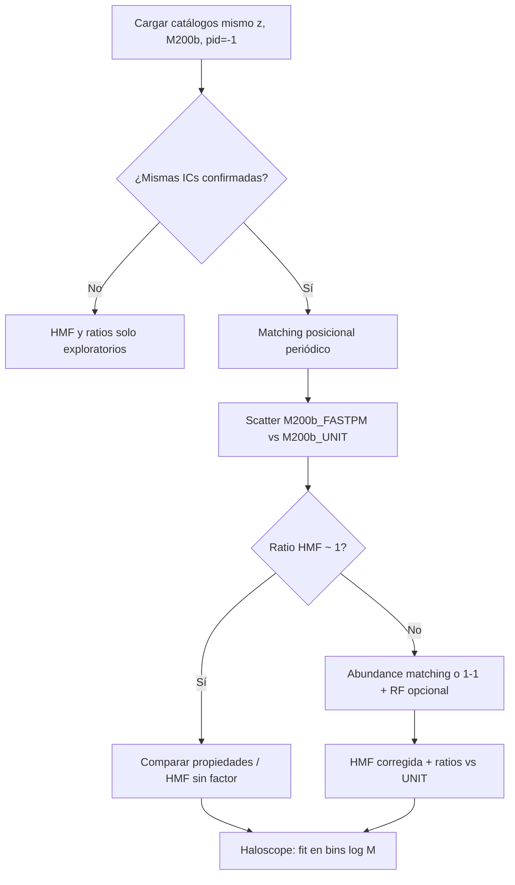

# Calibración de masas de halos: FastPM vs UNIT

| Campo | Valor |
| --- | --- |
| Fecha | 2026-08-27 |
| Tarea Notion | [HALOSCOPE > Comparación masas FastPM vs UNIT](https://app.notion.com/p/3ab2070c3c288089814ec11fb2afb7cc) |
| Issue relacionada | [#16 HMF + ratios](https://github.com/computationalAstroUAM/density_field_properties/issues/16) |
| Referencia principal | Ramakrishnan et al. 2025, A&A 697, A70 ([arXiv:2410.07361](https://arxiv.org/abs/2410.07361)) |
| Estado | Borrador — primera aproximación |

---

## 1. Qué pide la tarea

Antes de comparar HMF, propiedades secundarias o ratios FastPM/UNIT, hay que comprobar si las **masas de halo son directamente comparables** entre simulaciones de distinta resolución o distinto finder. La tarea pide:

1. Localizar en Ramakrishnan el procedimiento LR vs HR.
2. Valorar si aplica a **FastPM ↔ UNIT**.
3. Proponer factor o pipeline de calibración documentado.
4. Anotar supuestos, incertidumbres y datos necesarios.

---

## 2. Resumen del paper (Ramakrishnan et al. 2025)

### 2.1 Setup LR / HR

- Simulaciones **UNIT** (`unit2`, Chuang et al. 2019): box 1 Gpc/h, cosmología Planck-like (Ωm=0.3089, h=0.6774, …).
- **HR**: mp = 1.2×10⁹ M☉/h.
- **LR**: mp 8× peor (9.6×10⁹ M☉/h) — misma cosmología, mismas ICs.
- Halos: **Rockstar** + consistent-trees, z=0.
- Masa por defecto: **M200b**.

Analogía con nuestro caso (notas Violeta): **LR-UNIT 2048³** como referencia “verdad” frente a **FastPM + Rockstar** como simulación aproximada/de menor resolución efectiva.

### 2.2 Mensaje central sobre masas (Secc. 3 + Apéndice C)

| Aspecto | Conclusión en el paper |
| --- | --- |
| ¿Haloscope modifica M200b? | **No.** La masa es la “primary property”; el algoritmo entrena y predice **propiedades secundarias** (cvir, λ, c/a, b/a) condicionadas a masa LR + entorno. |
| ¿Hace falta recalibrar masas para Haloscope? | **No, en su caso LR↔HR UNIT.** Apéndice C.1: mejorar la HMF con RF (Forero-Sánchez+22) es posible pero **marginal** para propiedades secundarias; no lo usaron en el flujo principal. |
| Diferencia LR vs HR en HMF | LR ≈ HR dentro del **10%** para halos con **≥40 partículas**; por debajo, cae el número de halos LR. |
| Corrección de masas opcional | **1-1 matching** LR↔HR + **Random Forest** (Forero-Sánchez et al. 2022): mejora completitud a masas altas; halos con <40 partículas siguen perdidos. |
| Definiciones de masa | M200b, M200c, Vpeak muy correlacionados; resultados robustos al cambiar definición (Ap. C). |

### 2.3 Procedimiento explícito de “reajuste” en el paper

Hay **dos niveles** distintos:

**A) Para Haloscope (notebook SIM→FastPM):**

- Entrenar por **bins de log M200b** en la simulación HR (SIM).
- Aplicar a halos LR/FastPM usando **su propia M200b** (no la recalibrada).
- Opcional en el notebook del grupo: `CALIBRATE_MASS=True` → `M200b_cal` por **abundance matching** SIM↔FastPM antes del `fit` (ver `issue-6-sim-to-fastpm-haloscope/analysis.md`). Esto alinea la función de masa acumulada entre catálogos, no corrige halo a halo.

**B) Para HMF / comparación de número de halos (Ap. C.1):**

1. Emparejar halos LR y HR (mismas ICs → matching posicional o por ID si existe).
2. Entrenar RF para predecir M200b_HR a partir de propiedades LR.
3. Comparar HMF corregida vs HR.

**C) Alternativa más simple (Fig. C.2, línea discontinua):**

- Solo **1-1 matching** de masas LR→HR (sin RF): ya acerca la HMF, pero queda déficit a bajas masas.

---

## 3. ¿Aplica a FastPM vs UNIT?

### 3.1 Analogía

| Paper (LR vs HR) | Nuestro caso (FastPM vs UNIT) |
| --- | --- |
| Misma suite UNIT, mismas ICs | **Pendiente confirmar** mismas ICs y cosmología (pregunta al lunes con Violeta/Adrián) |
| LR = 8× peor resolución en mp | FastPM ≈ método PM aproximado + posible diferente resolución de grid/partículas |
| Rockstar en ambos | Rockstar PM vs Rockstar NBody en FastPM; UNIT con Rockstar |
| z = 0 | Nuestro interés: **z ≈ 1** (snap FastPM `out_8.list`, UNIT snapshot equivalente) |

**Conclusión preliminar:** el **criterio conceptual** sí aplica — no asumir M200b comparable sin comprobar HMF y, si hace falta, aplicar matching de abundancia o corrección 1-1/RF. Pero **FastPM no es un LR del mismo código N-body**: hay diferencias de solver, resolución efectiva y posiblemente finder adicional (FoF nativo FastPM).

### 3.2 Tres fuentes de discrepancia de masa

1. **Resolución / convergencia** (como LR vs HR en Ramakrishnan).
2. **Finder distinto** (Rockstar PM vs NBody vs FoF) — issue [#14 R200c vs R200b](https://github.com/computationalAstroUAM/density_field_properties/issues/14).
3. **Simulación aproximada** (FastPM) vs N-body completo (UNIT): sesgo sistemático en masa y en número de halos, no solo scatter.

Por tanto, para **HMF (#16)** hace falta más que el argumento “Haloscope no recalibra masas”: hay que **medir** las cuatro curvas y los ratios respecto a UNIT.

### 3.3 Recomendación por uso

| Objetivo | ¿Calibrar masas? | Método sugerido (1ª aprox.) |
| --- | --- | --- |
| Haloscope SIM→FastPM | Probablemente **sí** (`CALIBRATE_MASS`) si SIM=UNIT HR y FastPM≈LR | Abundance matching global SIM↔FastPM; entrenar bins en M200b SIM; predecir en FastPM con M200b_cal o bin equivalente |
| HMF comparativa (#16) | **Sí, documentar** | Plot HMF cruda + ratio; si ratio ≠ 1, probar 1-1 matching posicional (mismas ICs) o escalado por percentiles de M |
| Propiedades secundarias emparejadas | Condicionar a **misma M200b** tras matching posicional | Comparar cvir, λ, etc. solo en pares emparejados (Δr < umbral) |

---

## 4. Pipeline propuesto (borrador)

### Pasos concretos (subset primero)

1. **Subset** 5k–10k halos FastPM (`out_8.list`, rockstar_out_pm) y UNIT (mismo z).
2. **HMF cruda** en bins log M200b; figura combinada + ratio/UNIT (issue #16).
3. **Matching posicional** (KD-tree, box periódico, umbral ~1 Mpc/h tentativo).
4. En pares: scatter M200b_FastPM vs M200b_UNIT; median ratio por bin de masa.
5. Si sesgo global: **abundance matching** (función acumulada) → `M200b_cal` para Haloscope.
6. Si mismas ICs y suficientes pares: evaluar **1-1 matching** como en Fig. C.2 (sin RF en v1).
7. Documentar definición de masa en etiquetas (M200b Rockstar).

---

## 5. Catálogos para HMF (#16)

| # | Catálogo | Ruta tentativa (MN5) | Notas |
| --- | --- | --- | --- |
| 1 | UNIT | Confirmar con Adrián (`hlist` o `.list` z≈1) | Referencia |
| 2 | FastPM FoF | Por localizar en `fastpm_tfm` | Finder distinto |
| 3 | FastPM Rockstar PM | `/data21/users/mruiz/fastpm_MN5/fastpm_tfm/rockstar_out_pm/out_8.list` | Candidato Haloscope |
| 4 | FastPM Rockstar NBody | `.../rockstar_out_nbody/out_8.list` | Alternativa (#14) |

Ver también `config/fastpm_folders.md` en `density_field_properties`.

---

## 6. Supuestos, incertidumbres y bloqueos

### Supuestos (a validar)

- Cosmología FastPM MN5 compatible con UNIT (cabecera `#Om`, `#h` en `.list`).
- M200b es la definición común en los cuatro catálogos.
- z de comparación alineado (snap 8 ↔ snapshot UNIT a a≈0.5–1).

### Incertidumbres

- FastPM no es LR del mismo integrador: el apéndice C puede **subestimar** la discrepancia real.
- RF de Forero-Sánchez+22 entrenado en UNIT LR↔HR puede no transferir a FastPM.
- Completeness Rockstar a baja masa distinta entre PM y NBody.

### Bloqueos

- **ICs FastPM ↔ UNIT** no confirmadas → matching 1-1 y scatter de masa no vinculantes hasta el lunes.
- **Ruta SIM/UNIT** para entrenar Haloscope aún sin fijar (issue #6).
- Elección **rockstar_out_pm vs nbody** pendiente (Violeta/Adrián).

---

## 7. Subtareas sugeridas (para Notion)

- [ ] HMF cruda en subset: UNIT vs FastPM PM vs NBody (+ FoF si hay ruta).
- [ ] Scatter M200b en pares emparejados (misma muestra que matching).
- [ ] Decidir si `CALIBRATE_MASS=True` en notebook Haloscope tras ver HMF.
- [ ] Cerrar definición de masa (#14) antes de ratios “publication-ready”.
- [ ] Escalar a catálogo completo vía script + Slurm cuando ICs confirmadas.

---

## 8. Referencias rápidas

- Ramakrishnan et al. 2025: Haloscope, Ap. C (masas), Ap. D (bins de masa).
- Forero-Sánchez et al. 2022: RF para corrección de masa LR→HR.
- Issue #6: `CALIBRATE_MASS` en flujo SIM→FastPM.
- Issue #16: HMF + ratios normalizados a UNIT.
- Notas Violeta: «Use of LR-UNIT, 2048³ and new FastPM w Rockstar».
