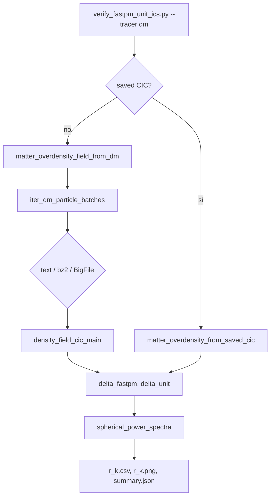

# Análisis: verificación ICs FastPM ↔ UNIT con r(k) en materia DM

| Campo | Valor |
| --- | --- |
| Fecha | 2026-09-06 |
| Estado | implementado — pendiente ejecución en Taurus y veredicto numérico |
| Repo producto | `density_field_properties` |
| Repo notas | `phd-agents-toolkit` |
| Plan relacionado | [`2026-08-31-fastpm-unit-seed-verification-taurus.md`](../planes-cursor/2026-08-31-fastpm-unit-seed-verification-taurus.md) |
| Script | `density_field_properties/scripts/verify_fastpm_unit_ics.py` |
| Slurm DM | `density_field_properties/slurm/verify_fastpm_unit_ics/main_verify_fastpm_unit_ics_dm.slurm` |

---

## Motivación

La verificación r(k) sobre **halos Rockstar** (mediana ≈ 0,17–0,35 tras corregir PID y muestreo) sigue lejos del umbral de Adrián (mediana r(k) > 0,9 a k bajos). Antes de escalar el resultado o iniciar matching 1-1, conviene un trazador más limpio de las **condiciones iniciales**: el campo de **materia oscura** δ(x) a **a = 1**.

Ventajas frente a halos:

- No depende de Rockstar, filtros `PID` ni sesgos de muestreo del catálogo.
- El cross-correlacionado mide directamente la alineación de modos de densidad.
- Reutiliza el pipeline CIC ya probado en Haloscope (`assembly_bias`, `particle_io`).

---

## Funcionalidad añadida

### Modo `--tracer dm`

El script `verify_fastpm_unit_ics.py` admite dos trazadores mutuamente excluyentes:

| `--tracer` | Descripción | Entrada por defecto |
| --- | --- | --- |
| `halos` | CIC sobre halos Rockstar (comportamiento anterior) | `out_8.list`, `out_128p.list.bz2` |
| `dm` | CIC sobre partículas DM → δ(x) → r(k) | FastPM BigFile + UNIT bz2 |

Salidas idénticas en ambos modos: `r_k.csv`, `r_k.png`, `summary.json` (campo `"tracer": "dm"` o `"halos"`).

### Rutas DM por defecto (Taurus, a = 1)

| Simulación | Ruta | Formato |
| --- | --- | --- |
| FastPM | `/data21/users/mruiz/fastpm_MN5/fastpm_tfm/output_01/snap_1.0000/1` | FastPM BigFile (`Position`) |
| UNIT | `/data21/UNITSIM/fixedAmp_InvPhase_001/DM_PARTICLES/dm_particles_0.5_128.bz2` | Texto whitespace-separated, bzip2 |

Constantes en `config.py`:

- `FASTPM_DM_PARTICLES_PATH`
- `UNIT_DM_PARTICLES_PATH` (snapshot **128** → `a = 1` según `redshift_list.txt`)
- `DM_MASS_PARTICLE_MSUN_H = 1.2e9` (Msun/h)
- `FASTPM_BOXSIZE_MPC_H` / `SIM_BOXSIZE_MPC_H` = 1000 Mpc/h

### Soporte `.bz2` en `particle_io.py`

Los ficheros UNIT comprimidos se detectan como formato `"text"` y se leen con `bz2.open` en lotes (`iter_dm_particle_batches`), igual que el texto plano usado en desarrollo local (`output/unit_files/dm_particles_0.5_128`).

### CIC precomputado (opcional)

Si ya existe un campo CIC guardado con `main_density_field_cic` (binario + `*_density_info.txt`), se puede omitir la deposición en vivo:

```bash
--fastpm-saved-density PATH --fastpm-saved-density-info PATH
--unit-saved-density PATH --unit-saved-density-info PATH
```

Si no se pasan, el script construye δ desde partículas (`DM+CIC` en `summary.json`).

---

## Uso en Taurus

### Interactivo (login node — solo smoke tests pequeños)

```bash
REPO=/home/arnes/santiago_arranz/density_field_properties
cd "$REPO"
source src/.venv/bin/activate  # o: conda activate density_field_properties
export PYTHONPATH="${REPO}/src:${PYTHONPATH}"

python scripts/verify_fastpm_unit_ics.py \
    --tracer dm \
    --n-grid 128 \
    --dm-batch-size 2000000 \
    --output-dir output/fastpm_unit_seed_check_dm_smoke
```

### Slurm (recomendado)

```bash
cd /home/arnes/santiago_arranz/density_field_properties
sbatch slurm/verify_fastpm_unit_ics/main_verify_fastpm_unit_ics_dm.slurm
```

Parámetros del job por defecto:

| Parámetro | Valor |
| --- | --- |
| `--tracer` | `dm` |
| `--n-grid` | 256 |
| `--dm-batch-size` | 5_000_000 |
| `--output-dir` | `output/fastpm_unit_seed_check_dm` |
| Tiempo | 8 h |
| CPUs | 16 |

Logs: `output/fastpm_unit_ics_dm.out` / `.log`

### Argumentos CLI relevantes (modo DM)

| Flag | Default | Notas |
| --- | --- | --- |
| `--tracer dm` | — | Activa modo materia |
| `--fastpm-dm` | BigFile `snap_1.0000/1` | Directorio de bloque FastPM |
| `--unit-dm` | `dm_particles_0.5_128.bz2` | Fichero UNIT a a=1 |
| `--dm-mass-particle` | `1.2e9` | Msun/h |
| `--dm-batch-size` | `5000000` | Tamaño de lote I/O |
| `--box-size` | 1000 Mpc/h | Sin cabeceras Rockstar en modo DM |
| `--n-grid` | 128 (script) / 256 (Slurm DM) | Resolución CIC |
| `--k-low-threshold` | 0.05 h/Mpc | Umbral para mediana resumen |

---

## Flujo interno



Módulos reutilizados:

- `density_field.particle_io` — detección de formato y lotes
- `density_field.cic_deposit.delta_field_from_dm_particles`
- `haloscope.sim_to_fastpm.assembly_bias.matter_overdensity_field_from_dm`
- `density_field.power_spectrum.spherical_power_spectra`

---

## Campos en `summary.json` (modo DM)

Además de `median_r_k_low`, `verdict`, `n_grid`, etc.:

```json
{
  "tracer": "dm",
  "fastpm_dm": "/data21/.../snap_1.0000/1",
  "unit_dm": "/data21/.../dm_particles_0.5_128.bz2",
  "dm_mass_particle_msun_h": 1200000000.0,
  "dm_batch_size": 5000000,
  "fastpm_dm_mode": "DM+CIC",
  "unit_dm_mode": "DM+CIC"
}
```

Veredicto automático (igual que halos):

- `compatible` si mediana r(k) ≥ 0,9 (k < umbral)
- `incompatible` si ≤ 0,3
- `inconclusive` en el intervalo intermedio

---

## Limitaciones y matices

### Fichero UNIT por defecto

`dm_particles_0.5_128.bz2` es el mismo snapshot que ya usa `slurm/density_field/main_density_field_cic.slurm` en desarrollo. Es **un fichero por snapshot** (índice 128 = a = 1), no el catálogo completo de 129 snapshots.

Si r(k) DM sigue bajo, alternativas a documentar en la siguiente iteración:

1. **Rejilla precomputada UNIT** `DM_DENS/dmdens_cic_128.dat` (2048³, formato Fortran unformatted de analysesim) — requeriría loader dedicado; no implementado en v1.
2. **Todos los slabs de partículas** del snapshot 128 si existieran ficheros adicionales por subvolumen (no observado en el listado actual de `DM_PARTICLES`).

### Coste computacional

- FastPM BigFile: lectura por lotes; job Slurm 8 h con `n_grid=256` y batch 5M.
- UNIT bz2: descompresión + `loadtxt` por lote; puede ser más lento que BigFile; monitorizar logs.

### Evolución no lineal

A **a = 1** el r(k) DM ya incluye crecimiento y virialización, no solo fases de ICs. Para ICs puras haría falta **z_ini** (p. ej. snapshot 0). El test a a = 1 es coherente con la comparación previa en halos Rockstar a z = 0 y con la pregunta «¿comparten la misma realización a z = 0?».

---

## Tests

Nuevos tests en `src/tests/density_field/test_particle_io.py`:

- `test_detect_bz2_text_file`
- `test_bz2_batches_single_batch`
- `test_bz2_batches_chunked`

---

## Criterio de éxito (pendiente run Taurus)

| Criterio | Umbral |
| --- | --- |
| Job Slurm DM | Termina sin error; `summary.json` con `"tracer": "dm"` |
| r(k) a k bajos | mediana r(k) > **0,9** → ICs compatibles (criterio Adrián) |
| Comparación halos vs DM | Si DM ≈ 1 y halos ≈ 0,3, el problema era trazador Rockstar; si ambos bajos, seeds distintas o convención de simulación |

---

## Siguientes pasos

1. Lanzar `sbatch slurm/verify_fastpm_unit_ics/main_verify_fastpm_unit_ics_dm.slurm` en Taurus.
2. Anotar mediana r(k) en esta nota y en el plan `2026-08-31-...`.
3. Si r(k) DM > 0,9: escalar a Adrián con figura DM; mantener halos como contraste.
4. Si r(k) DM bajo: revisar param files / seeds; valorar snapshot IC (z alto) o `dmdens_cic_128.dat`.
5. Actualizar Notion «Verificar ICs» cuando exista resultado numérico.

---

## Veredicto (plantilla — rellenar tras run)

- **Run Slurm:** _pendiente_
- **mediana r(k), k < 0.05 h/Mpc:** _pendiente_
- **ICs compatibles (DM):** _pendiente_
- **Artefactos:** `density_field_properties/output/fastpm_unit_seed_check_dm/`
