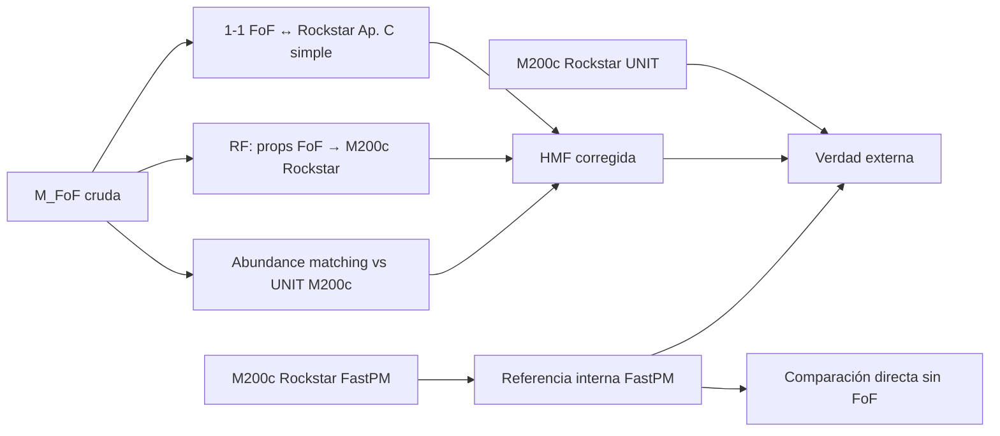

# Análisis: masa FoF + calibración Ap. C Ramakrishnan vs M200c Rockstar

| Campo | Valor |
| --- | --- |
| Fecha | 2026-09-08 |
| Estado | borrador — diseño de experimento |
| Repo / tema | Haloscope, HMF, FastPM FoF vs Rockstar |
| Relacionado | [`2026-08-27-haloscope-mass-calibration.md`](2026-08-27-haloscope-mass-calibration.md), [`2026-09-06-halo-hmf-unit-fastpm-a1.md`](2026-09-06-halo-hmf-unit-fastpm-a1.md), [`2026-09-08-rdisp-forma-masa-m200b.md`](2026-09-08-rdisp-forma-masa-m200b.md) |
| Referencia | Ramakrishnan et al. 2025, Ap. C ([arXiv:2410.07361](https://arxiv.org/abs/2410.07361)); Forero-Sánchez et al. 2022 |

---

## Pregunta

Si **no** intentamos equiparar físicamente M_FoF con M200c (definiciones distintas), ¿tiene sentido trabajar con **masas FoF** aplicando la **calibración del Apéndice C** de Ramakrishnan directamente sobre ellas?

**Objetivo:** comparar explícitamente el uso de:

1. **Masa FoF** (cruda y/o calibrada estilo Ap. C) en FastPM.
2. **M200c de Rockstar** (FastPM y/o UNIT como referencia).

---

## Respuesta corta

| Pregunta | Respuesta |
| --- | --- |
| ¿Aplicar Ap. C **literalmente** (coeficientes LR→HR UNIT) sobre M_FoF? | **No** — el paper calibra Rockstar LR→Rockstar HR, misma definición de masa. |
| ¿Usar la **metodología** Ap. C (1-1 matching ± RF) FoF→M200c Rockstar? | **Sí** — como experimento comparativo bien definido. |
| ¿Usar M_FoF calibrada como sustituto de M200c frente a UNIT? | **Solo tras validar** HMF y scatter en pares; Rockstar M200c sigue siendo referencia más limpia. |

---

## Qué hace realmente el Apéndice C (Ramakrishnan)

El Ap. C **no** convierte una definición de masa en otra. Corrige **incompletitud y scatter de resolución** entre catálogos **homogéneos**:

| Elemento | Setup Ramakrishnan Ap. C |
| --- | --- |
| Simulaciones | UNIT LR vs UNIT HR (**mismas ICs**) |
| Finder | **Rockstar** en ambos |
| Masa | **M200b** en ambos (M200c correlacionada; resultados robustos) |
| Problema | LR subestima masa y pierde halos pequeños |
| Solución C.1 | 1-1 matching LR↔HR + **RF** (Forero-Sánchez+22) → predice M200b_HR |
| Solución C.2 (simple) | Solo 1-1 matching: reemplazar M_LR por M_HR del par (Fig. C.2) |

**Haloscope en el paper:** no recalibra masas; entrena propiedades secundarias condicionadas a M200b LR.

**Abundance matching** (notebook del grupo, `CALIBRATE_MASS`): alinea la **función de masa acumulada** global SIM↔FastPM; no es lo mismo que Ap. C halo a halo.

---

## Qué cambia al usar masa FoF

Nuestro caso añade una capa **distinta** a LR vs HR:

| Fuente de discrepancia | Ap. C Ramakrishnan | FoF vs Rockstar |
| --- | --- | --- |
| Resolución / mp | Sí | Parcialmente (FastPM PM) |
| Solver (PM vs N-body) | No | **Sí** |
| Finder (FoF vs Rockstar) | No | **Sí** |
| Definición de masa (N×m_p vs SO) | No | **Sí** |
| Conjunto de halos (identidades distintas) | Mismo objeto, peor resuelto | **Objetos no equivalentes** |

Por tanto: **transferir coeficientes del RF de Ramakrishnan a M_FoF no es válido**. Lo que sí traslada es el **protocolo experimental**.

---

## ¿Tiene sentido la metodología Ap. C sobre M_FoF?

### Sí, como estudio comparativo

Tiene sentido **medir** cuánto mejora cada capa de calibración:

### Tres niveles de calibración (de más simple a más Ap. C)

| Nivel | Procedimiento | Qué corrige | Qué no corrige |
| --- | --- | --- | --- |
| **0** | M_FoF = `Length` × m_p | — | Definición, finder, física PM |
| **1** | Abundance matching global FoF→UNIT M200c | Normalización de la HMF acumulada | Scatter halo a halo; halos sin pareja |
| **2** | 1-1 matching posicional FoF↔Rockstar; M_cal = M200c_Rockstar del par | Sesgo medio en subconjunto emparejado | Halos FoF sin pareja Rockstar; merges/splits |
| **3** | RF entrenado en pares: features FoF → M200c_Rockstar | Scatter y sesgo en emparejados; extrapola a no emparejados con riesgo | Requiere ICs compartidas y muchos pares; RF específico de FoF↔Rockstar |

El **nivel 2** es el análogo directo de Fig. C.2 (Ramakrishnan). El **nivel 3** es Ap. C.1 con Forero-Sánchez, pero **reentrenado** con:

- **Input:** M_FoF, `Length`, `Rdisp`, `Vdisp`, posición, entorno, …
- **Target:** M200c (o M200b) del halo Rockstar emparejado en la **misma** simulación FastPM.

---

## Diseño del experimento propuesto

### Catálogos (mismo z, misma caja)

| Etiqueta | Masa | Uso |
| --- | --- | --- |
| `fof_raw` | M_FoF = N × m_p | Línea base FoF |
| `fof_am` | M_FoF tras abundance matching a UNIT M200c | Como `CALIBRATE_MASS` pero sobre FoF |
| `fof_apc_simple` | M200c Rockstar del par 1-1 (solo halos emparejados) | Ap. C Fig. C.2 |
| `fof_apc_rf` | M200c predicha por RF(FoF props) | Ap. C.1 reentrenado |
| `rockstar_fastpm` | M200c Rockstar N-body FastPM | Referencia interna |
| `rockstar_unit` | M200c Rockstar UNIT | Referencia externa |

### Métricas

1. **HMF:** dn/dlog M para cada etiqueta; ratios vs UNIT.
2. **Scatter:** log M_FoF vs log M200c en pares emparejados (antes y después de calibración).
3. **Completitud:** fracción de halos FoF con pareja Rockstar vs fracción Rockstar con pareja FoF.
4. **Propiedades secundarias Haloscope:** si se entrena condicionado a masa, comparar bins usando `fof_am` vs `rockstar_fastpm` M200c.

### Requisitos

- **ICs compartidas** FastPM ↔ UNIT (bloqueante para matching 1-1 con UNIT; para FoF↔Rockstar **en FastPM** basta la misma sim).
- Umbral de matching periódico (p. ej. Δr < 0.5–1 Mpc/h) documentado.
- Mismo corte de completitud (p. ej. N_part ≥ 20) en todas las curvas si se compara HMF.

---

## Comparación conceptual: FoF calibrado vs Rockstar M200c

| Criterio | M_FoF + Ap. C (niveles 2–3) | M200c Rockstar directo |
| --- | --- | --- |
| Definición de masa alineada con UNIT | Solo **después** de calibrar contra Rockstar/UNIT | **Sí** por construcción |
| Cobertura de catálogo | FoF tiene ~15.5 M halos vs ~30 M Rockstar N-body (HMF a=1) | Mayor completitud N-body |
| Coste computacional | FoF ya generado; calibración offline | Rockstar ya corrido en vuestro caso |
| Interpretación física | Masa “efectiva” emparejada; mezcla definiciones | Masa SO estándar |
| Uso en Haloscope | Masa primaria condicionante; scatter en bins | **Recomendado** si el catálogo de aplicación es Rockstar |

**Conclusión práctica:**

- Para **HMF y comparación con UNIT:** el experimento FoF+Ap. C es **útil para cuantificar** cuánto del desajuste viene del finder vs de la física PM. No sustituye la curva Rockstar N-body como referencia principal.
- Para **Haloscope:** si el catálogo de aplicación es **Rockstar**, usar **M200c (o M200b) Rockstar** + abundance matching opcional a UNIT. Reservar FoF+Ap. C como **línea alternativa** documentada en la misma figura/tablas.
- Si el catálogo de aplicación fuera **solo FoF bigfile**, entonces Ap. C reentrenado FoF→M200c Rockstar es la forma más rigurosa de obtener una masa “tipo SO” sin reidentificar halos en cada uso.

---

## Riesgos y advertencias

1. **Halos sin pareja:** FoF y Rockstar no identifican el mismo conjunto. Ap. C simple deja fuera o sin corregir halos no emparejados → sesgo en la HMF si no se documenta.
2. **RF no transferible:** el modelo Forero-Sánchez de UNIT LR→HR **no** se aplica a FastPM FoF; hay que reentrenar.
3. **M200b vs M200c:** Ramakrishnan usa M200b; si comparáis con M200c, ser consistentes en target y en UNIT. Las definiciones están muy correlacionadas pero no son idénticas.
4. **No confundir niveles:** abundance matching (nivel 1) ≠ Ap. C halo a halo (niveles 2–3). Conviene plotear **las cuatro curvas** en la misma figura HMF.

---

## Recomendación

| Objetivo | Acción |
| --- | --- |
| Comparar FoF vs Rockstar | **Sí:** implementar niveles 0, 1, 2 y curva Rockstar en `compare_halo_hmf.py` o script hermano |
| Usar Ap. C Ramakrishnan “off the shelf” sobre M_FoF | **No** |
| Masa principal para Haloscope / UNIT | **M200c (o M200b) Rockstar** FastPM N-body |
| M_FoF + Ap. C reentrenado | **Línea secundaria** en HMF; publicar ratios lado a lado |

---

## Siguientes pasos

- [ ] Matching FoF ↔ Rockstar N-body en FastPM (mismo snap, a=1).
- [ ] Scatter log M_FoF vs log M200c antes de calibración.
- [ ] HMF: `fof_raw`, `fof_am`, `fof_apc_simple`, `rockstar_nbody`, `unit`.
- [ ] Decidir target de masa (M200b vs M200c) y fijar en issue #14.
- [ ] Si scatter post-matching es baja (<10–15 %): evaluar RF (nivel 3); si no, quedarse en nivel 2 o Rockstar directo.

---

## Referencias

- Calibración general FastPM vs UNIT: [`2026-08-27-haloscope-mass-calibration.md`](2026-08-27-haloscope-mass-calibration.md)
- HMF ejecutada: [`2026-09-06-halo-hmf-unit-fastpm-a1.md`](2026-09-06-halo-hmf-unit-fastpm-a1.md)
- `mass_matching.py` (abundance matching): `density_field_properties/src/density_field_properties/haloscope/sim_to_fastpm/mass_matching.py`
- Rdisp / NFW: [`2026-09-08-rdisp-nfw-estimacion-r200c.md`](2026-09-08-rdisp-nfw-estimacion-r200c.md)
