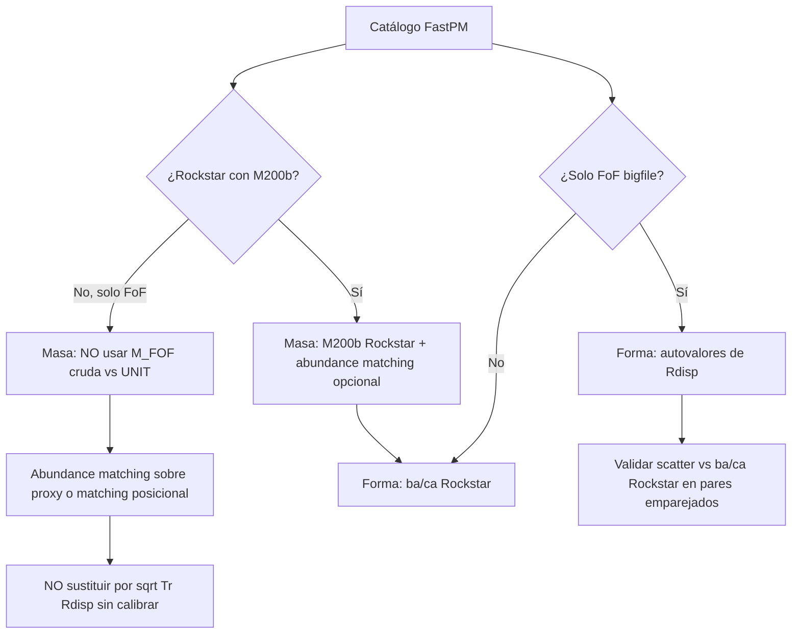

# Análisis: ¿Rdisp sirve para relacionar forma/masa FoF con M200b o M200c?

| Campo | Valor |
| --- | --- |
| Fecha | 2026-09-08 |
| Estado | borrador — criterio de diseño |
| Repo / tema | Haloscope, FastPM FoF vs UNIT Rockstar |
| Relacionado | [`2026-09-06-fastpm-fof-bigfile-fields.md`](2026-09-06-fastpm-fof-bigfile-fields.md), [`2026-08-27-haloscope-mass-calibration.md`](2026-08-27-haloscope-mass-calibration.md), [`2026-09-06-halo-hmf-unit-fastpm-a1.md`](2026-09-06-halo-hmf-unit-fastpm-a1.md) |

---

## Pregunta

No usamos la masa FoF nativa (`Length` × m_p) porque no es directamente comparable con **M200b** o **M200c** de Rockstar en UNIT (sobredensidad esférica). ¿Tiene sentido usar **`Rdisp`** para relacionar la forma y el “tamaño” del halo FoF con M200b o M200c?

---

## Respuesta corta

| Uso propuesto | ¿Tiene sentido? | Comentario |
| --- | --- | --- |
| Sustituir M_FOF por un proxy de masa basado en `Rdisp` | **No recomendado** | Scatter y sesgo grandes frente a M200b/M200c |
| Calibrar M200b halo a halo solo con `Rdisp` | **Insuficiente** | Falta información de densidad; FoF ≠ contorno esférico |
| Describir **forma** del grupo FoF (ba, ca) | **Sí** | Autovalores de `Rdisp`; comparable en espíritu a `ba`/`ca` de Rockstar, pero definición distinta |
| Feature auxiliar en matching o RF masa | **Sí, con ICs compartidas** | Junto a posición, `Length`, `Vdisp` |
| Condicionar Haloscope por masa | **No usar `Rdisp` como masa** | Seguir con M200b Rockstar + abundance matching |

---

## Por qué FoF masa y M200b no son comparables

Son **definiciones distintas** del “halo”:

| | FoF (FastPM) | M200b / M200c (Rockstar) |
| --- | --- | --- |
| Criterio | Enlace por distancia (linking length b × separación media) | Masa dentro de esfera donde ρ = 200 × ρ_crit (b o c) |
| Frontera | Irregular, depende de b y de vecinos | Esférica por construcción |
| Masa | N_part × m_p | Integral de densidad hasta R200 |
| Centro | Media de posiciones FoF | Centro de Rockstar (puede diferir) |

La HMF comparativa ([`2026-09-06-halo-hmf-unit-fastpm-a1.md`](2026-09-06-halo-hmf-unit-fastpm-a1.md)) ya muestra que M_FOF y M200b no coinciden: factores ~2–3 en bins solapados, además de diferencias de completitud.

**Conclusión:** evitar M_FOF como masa de referencia frente a UNIT es correcto. La calibración adecuada sigue siendo **abundance matching** global o **matching posicional + scatter** halo a halo (Ramakrishnan; [`2026-08-27-haloscope-mass-calibration.md`](2026-08-27-haloscope-mass-calibration.md)).

---

## Qué es físicamente `Rdisp`

`Rdisp` es el tensor de segundos momentos espaciales ⟨r_i r_j⟩ de las partículas FoF respecto al centro del grupo (ver sección dedicada en [`2026-09-06-fastpm-fof-bigfile-fields.md`](2026-09-06-fastpm-fof-bigfile-fields.md)).

- **Traza** Tr(`Rdisp`) → tamaño espacial del grupo FoF (R_rms).
- **Autovalores** → forma (elongación, aplanamiento).
- **No** es el radio R200b ni R200c.

La relación entre tamaño FoF y R200 es **empírica** y depende de:

- linking length (LL-0.200 en nuestros catálogos),
- perfil de densidad NFW (concentración),
- entorno y subestructura,
- resolución PM (FastPM suaviza escalas pequeñas).

Una conversión tipo M ∝ R³ con R ~ √Tr(`Rdisp`) ignoraría que el FoF puede incluir material fuera de R200 o perder material interior según b.

---

## ¿`Rdisp` para inferir M200b o M200c?

### Como proxy directo de masa — débil

Escalado dimensional: M ∝ ρ̄ R³. Si asumieras densidad típica y R ~ R_rms, obtendrías un orden de magnitud, pero:

1. **Sesgo sistemático:** el contorno FoF no coincide con la iso-superficie 200×ρ_crit.
2. **Scatter:** típicamente **~0.1–0.3 dex** o más entre M proxy y M200b incluso con calibración, peor que usar `Length` × m_p con abundance matching.
3. **M200b vs M200c:** `Rdisp` no distingue baryon vs total matter; la conversión a R200b o R200c requeriría factores distintos (R200c < R200b). Rockstar da ambas masas muy correlacionadas; `Rdisp` no aporta cuál elegir.

**Recomendación:** no usar √Tr(`Rdisp`) ni autovalores como sustituto de M200b en HMF o en bins de Haloscope.

### Como feature en calibración halo a halo — razonable

Si FastPM y UNIT comparten **ICs** (pendiente de confirmar):

- Matching posicional: posición + opcionalmente `Length`, Tr(`Rdisp`), `Vdisp`.
- RF estilo Forero-Sánchez+22: predecir M200b_UNIT a partir de propiedades FoF FastPM.

Aquí `Rdisp` **sí aporta** (junto con otras variables), porque reduce ambigüedad cuando varios candidatos FoF están cerca. No reemplaza la necesidad de M200b Rockstar en el catálogo de entrenamiento.

### Para forma (ba, ca) — sí, con matices

Haloscope predice propiedades secundarias (`cv`, `Spin`, `ca`, `ba`) condicionadas a **M200b** ([`config.py`](../../../density_field_properties/src/density_field_properties/haloscope/sim_to_fastpm/config.py) en `density_field_properties`).

Desde `Rdisp` puedes construir proxies de forma:

- c/a ≈ √(λ₃/λ₁), b/a ≈ √(λ₂/λ₁) con autovalores de **S**.

**Pero:**

| Rockstar `ba`, `ca` | `Rdisp` eigenvalue ratios |
| --- | --- |
| Inercia / perfil dentro de R200 (definición Rockstar) | Distribución de partículas **FoF** |
| Misma convención que UNIT de referencia | Definición distinta → no comparar numéricamente sin validar scatter |

**Uso coherente:** si el catálogo FastPM de aplicación es **FoF bigfile** (no Rockstar), tiene sentido usar forma derivada de `Rdisp` como **target observado en FastPM** y entrenar Haloscope para predecirla desde entorno + masa calibrada. Si el catálogo FastPM es **Rockstar**, usar `ba`/`ca` de Rockstar directamente.

---

## Matriz de decisión para el pipeline

---

## Recomendaciones concretas

1. **Masa frente a UNIT:** mantener **M200b Rockstar** en FastPM cuando exista (`rockstar_out_nbody`); si solo hay FoF, **abundance matching** (como en `mass_matching.py`), no calibración basada solo en `Rdisp`.
2. **Forma:** `Rdisp` es útil para **caracterizar el FoF**; para comparar con UNIT usar `ba`/`ca` de Rockstar en ambos lados cuando sea posible.
3. **Validación mínima** (cuando ICs confirmadas): emparejar FoF ↔ Rockstar en la misma simulación; scatter de √Tr(`Rdisp`) vs R200b; scatter de c/a(`Rdisp`) vs `ca` Rockstar.
4. **M200b vs M200c:** Ramakrishnan reporta robustez al cambiar definición; si usas Rockstar, elige una (p. ej. M200b) y documenta. `Rdisp` no desempata entre b y c.
5. **No mezclar** en el mismo análisis: masa FoF cruda, masa proxy desde `Rdisp`, y M200b Rockstar sin etiquetar claramente la definición.

---

## Siguientes pasos sugeridos

- [ ] Confirmar ICs FastPM ↔ UNIT (bloqueante para matching 1-1).
- [ ] En subset: correlación Tr(`Rdisp`) vs M200b Rockstar en halos FastPM con ambos catálogos.
- [ ] Comparar c/a, b/a desde `Rdisp` vs Rockstar en pares emparejados.
- [ ] Documentar en pipeline Haloscope qué catálogo FoF vs Rockstar alimenta forma vs masa.

---

## Notas relacionadas (dudas posteriores)

- NFW + `Rdisp` → R200c / M200c: [`2026-09-08-rdisp-nfw-estimacion-r200c.md`](2026-09-08-rdisp-nfw-estimacion-r200c.md)
- Masa FoF + calibración Ap. C Ramakrishnan vs M200c Rockstar: [`2026-09-08-fof-masa-calibracion-ramakrishnan-apc.md`](2026-09-08-fof-masa-calibracion-ramakrishnan-apc.md)

---

## Referencias

- Tensor de segundos momentos y `Rdisp`: [`2026-09-06-fastpm-fof-bigfile-fields.md`](2026-09-06-fastpm-fof-bigfile-fields.md)
- Calibración de masas Haloscope: [`2026-08-27-haloscope-mass-calibration.md`](2026-08-27-haloscope-mass-calibration.md)
- HMF UNIT vs FastPM: [`2026-09-06-halo-hmf-unit-fastpm-a1.md`](2026-09-06-halo-hmf-unit-fastpm-a1.md)
- FastPM `fof.c`, `rfof.c`; Rockstar columnas `ba`, `ca`, `M200b`, `M200c`
