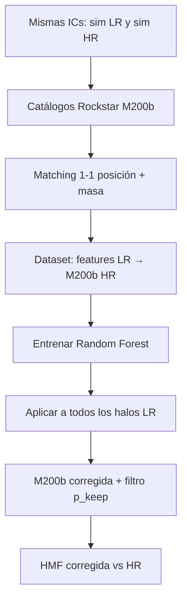

# Análisis: Apéndice C Ramakrishnan — ¿por qué RF para la HMF?

| Campo | Valor |
| --- | --- |
| Fecha | 2026-09-09 |
| Estado | borrador — nota conceptual |
| Referencia | Ramakrishnan et al. 2025, Ap. C.1 ([arXiv:2410.07361](https://arxiv.org/abs/2410.07361)); Forero-Sánchez et al. 2022 ([arXiv:2203.12669](https://arxiv.org/abs/2203.12669)) |
| Relacionado | [`2026-08-27-haloscope-mass-calibration.md`](2026-08-27-haloscope-mass-calibration.md), [`2026-09-08-fof-masa-calibracion-ramakrishnan-apc.md`](2026-09-08-fof-masa-calibracion-ramakrishnan-apc.md) |

---

## Preguntas

1. ¿Por qué el Apéndice C estudia mejorar la HMF con random forest?
2. ¿Es porque la LR no representa bien el extremo inferior de masa por resolución?
3. ¿Cómo funciona? ¿El RF predice la masa que «debería» tener un halo?

---

## Contexto del experimento

| | HR (UNIT) | LR (UNIT) |
| --- | --- | --- |
| Partículas | 4096³ | 2048³ |
| m_p | 1.2×10⁹ M☉/h | 9.6×10⁹ M☉/h (8× peor) |
| ICs | **Mismas** (phase-paired UNIT) | **Mismas** |
| Finder | Rockstar | Rockstar |
| Masa | M200b | M200b |

Mismo código, mismo finder, misma definición de masa. Solo cambia la resolución.

**Haloscope (flujo principal)** no toca las masas: entrena propiedades secundarias (cvir, λ, ba, ca) condicionadas a M200b LR. El Ap. C es un **experimento aparte** sobre si conviene corregir masas antes de usar el catálogo.

---

## ¿Por qué «mejorar» la HMF de la LR?

Hay **dos problemas distintos** que la corrección aborda de forma parcial:

### 1. Sesgo y scatter en la masa medida (halo a halo)

Para el **mismo halo físico**, M200b_LR ≠ M200b_HR: la baja resolución altera el perfil de densidad que ve Rockstar y la masa asignada. No es solo un factor global; hay scatter.

### 2. Completitud del catálogo (número de halos)

La LR **pierde halos** o los fusiona:

- Halos que en HR existen con muchas partículas en LR tienen pocas o ninguna.
- En Fig. C.2 (Ramakrishnan): la HMF LR coincide con HR dentro del **10 %** solo para halos con **≥ 40 partículas**.
- El número de halos LR con 40 partículas está **~10 % por debajo** del HR.
- Halos con **< 40 partículas** en LR siguen **perdidos** tras cualquier corrección de masa.

```text
Problema A: «Este halo existe en LR pero su M200b está mal medida»
Problema B: «Este halo no aparece en LR (o aparece fusionado)»
```

El RF corrige sobre todo el **problema A**. El **problema B** no se resuelve prediciendo una masa mejor: si el halo no está en el catálogo LR, no hay fila que corregir.

### Motivación de fondo

Los mocks de surveys (DESI, Euclid) quieren **máximo rango dinámico de masa** en cajas grandes. Correr HR en 1 Gpc/h es caro; la LR da volumen pero peor resolución. La idea es obtener un catálogo «tipo HR» desde LR + ML (Forero-Sánchez+22).

---

## ¿Es solo el extremo inferior de masa?

**En parte, pero no solo.**

| Régimen | Qué pasa en LR vs HR |
| --- | --- |
| Masas altas (muchas partículas) | HMF similar (~10 %); masas individuales con scatter |
| Masas medias-bajas (≈ 40–100 partículas) | Empieza el déficit de **número** de halos |
| Masas muy bajas (< 40 partículas) | Halos **ausentes** en LR; corrección de masa no los recupera |

La corrección RF **mejora la completitud a masas altas** (reclasifica y reasigna masas de halos que sí existen en LR). El **colgajo bajo** de la HMF LR persiste.

---

## ¿Cómo funciona el random forest? (Forero-Sánchez+22, usado en Ap. C)

### Paso 1 — Matching 1-1 LR ↔ HR

Para cada halo HR, buscar candidato LR:

- Cercano en **posición** (KD-tree, típicamente < 5 Mpc/h).
- Masa LR no demasiado distinta de M_HR (|M_LR − M_HR| / M_HR < umbral, p. ej. 0.95).

Resultado: pares (halo_LR, halo_HR) que son el **mismo objeto** en las dos simulaciones. ~99 % de HR emparejados; ~54 % de LR (el resto son subestructura o artefactos LR sin contraparte HR clara).

**Versión simple (línea discontinua Fig. C.2):** reemplazar M200b_LR por M200b_HR del par. Sin ML.

### Paso 2 — Entrenar el RF

| | |
| --- | --- |
| **Entradas (features)** | Propiedades del halo **LR**: M200b_LR, overdensity local, σ posición, σ velocidad, radio, spin, entorno (varias escalas de densidad), … |
| **Salidas (targets)** | (1) ¿Tiene match válido con HR? (2) **log M200b_HR** del halo emparejado |

El RF predice dos números por halo LR:

```text
p_keep   = probabilidad de que el halo LR tenga contraparte HR fiable
log M_HR = masa M200b que tendría en la simulación HR
```

### Paso 3 — Aplicar al catálogo LR completo

Para **cada** halo LR (no solo los emparejados en training):

1. RF predice `log M_HR` corregida.
2. RF predice si **mantener** o **descartar** el halo (según `p_keep`).

La HMF del catálogo corregido se compara con HR.

### Respuesta directa a «¿predice la masa que debería tener?**

**Sí**, en este sentido:

> Dado un halo en la simulación LR (con sus propiedades observables), el RF estima la **M200b que tendría el mismo halo en la simulación HR**, aprendido de miles de pares emparejados con mismas ICs.

No es una predicción cosmológica abstracta: es **transferencia LR → HR** en un par de sims emparejadas.

---

## Esquema del flujo



---

## ¿Por qué Ramakrishnan lo pone en Apéndice y no en el flujo Haloscope?

Conclusión del paper (Ap. C.1):

| Hallazgo | Implicación |
| --- | --- |
| RF mejora HMF respecto a LR cruda | Útil para mocks que priorizan función de masa |
| Mejora es **marginal** para propiedades secundarias | Haloscope **no usa** esta corrección en el flujo principal |
| Halos < 40 partículas siguen perdidos | No sustituye una sim HR real en la cola baja |
| LR y HR ya acuerdan ~10 % en M para N ≥ 40 | Para assembly bias secundario, corregir masa no aporta mucho |

**Haloscope** mejora cvir, λ, ba, ca condicionado a **M200b LR sin modificar**. La masa se trata como propiedad primaria fija.

---

## Fig. C.2 — cómo leerla

| Curva | Significado |
| --- | --- |
| Naranja (HR) | Referencia «verdad» |
| Morada (LR) | HMF sin corregir; ~10 % de HR para M(≥40 partículas) |
| Discontinua negra | Solo 1-1 matching (sustituir M_LR por M_HR del par) |
| LR + RF | Tras random forest; mejor en masas altas, cola baja sigue baja |

---

## Relación con nuestro caso (FastPM / FoF)

El Ap. C asume **Rockstar LR vs Rockstar HR, misma definición M200b**. Para FastPM + FoF:

- El protocolo (matching + RF) es transferible **como idea**.
- Los coeficientes del RF de Ramakrishnan **no** se aplican a FoF.
- FoF añade discrepancia de **finder y definición de masa**, no solo de resolución.

Ver [`2026-09-08-fof-masa-calibracion-ramakrishnan-apc.md`](2026-09-08-fof-masa-calibracion-ramakrishnan-apc.md).

---

## Resumen en tres frases

1. El Ap. C explora si vale la pena **corregir M200b halo a halo** en LR antes de usar el catálogo, porque la LR subestima número y masa de halos respecto a HR.
2. El problema es **doble**: masas mal medidas (scatter) y **halos que faltan** en LR; el RF solo arregla bien lo primero para halos que **sí existen** en LR.
3. El RF **sí predice la M200b HR** de cada halo LR a partir de sus propiedades, entrenado en pares emparejados; Ramakrishnan concluye que esto **no mejora lo suficiente** las propiedades secundarias como para integrarlo en Haloscope.

---

## Detalle: cómo se entrena el RF (Forero-Sánchez+22)

### Dataset por halo LR

Tras el matching 1-1, **cada halo LR** del volumen de entrenamiento es una fila:

| Rol | Variables |
| --- | --- |
| **Features X** (solo LR) | `log M_LR`, overdensity local en varias escalas (`log_dens` en grids 64–2048), `log σ` posición, `log σ_v`, `log r_sph`, spin, velocidad del centro de masa, … |
| **Target y** (del par HR si existe) | Vector 2D: `(label_match, log M_HR)` |

Reglas del target:

- **Halo LR emparejado:** `label_match = 1`, `log M_HR` = log M200b del halo HR del par.
- **Halo LR sin par:** `label_match = 0`, `log M_HR = 0` (placeholder).

El modelo predice **ambas** salidas a la vez: `ŷ = (p_keep, log M̂_HR)` con un único `RandomForestRegressor` y MSE sobre el vector 2D.

### ¿Solo halos emparejados en el training?

**No.** Entrenan con **todos** los halos LR del subvolumen de train (emparejados y no emparejados). Los no emparejados enseñan al RF a **descartar** candidatos espurios (`p_keep` bajo).

### Partición train / validation / test

**No usan toda la caja mezclada al azar.** Parten el volumen **espacialmente** (mismas ICs, regiones distintas de la caja 1 Gpc/h):

| Subconjunto | Fracción del box | Uso |
| --- | --- | --- |
| **Train** | 0.5 × 1 × 1 (h⁻³ Gpc³) | Ajustar el RF |
| **Validation** | 0.5 × 0.5 × 1 | Elegir hiperparámetros (p. ej. `Δ_M^th`, profundidad) |
| **Test** | 0.5 × 0.5 × 1 (otro cuadrante) | HMF, P(k), correlación — métricas finales |

El matching 1-1 se hace **dentro** de cada subvolumen por separado (o se construyen pares solo entre halos del mismo split).

### Hiperparámetros fiduciales (Forero-Sánchez)

- `n_tree = 10`, `d_max = 64`
- Ramakrishnan: mismos hiperparámetros salvo `n_estimators` entre 1 y 10

### Evaluación

La pérdida de entrenamiento es MSE sobre `(label, log M)`. La **validación científica** no es scatter halo a halo, sino **HMF**, power spectrum y correlación del catálogo LR corregido vs HR en el **test set** (volumen no visto).

### Pseudocódigo mínimo

```python
# Tras matching en subvolumen de train
X_train = lr_features[train_mask]          # solo propiedades LR
y_train = np.column_stack([
    labels_matched[train_mask],            # 0 o 1
    np.where(labels_matched, log_m_hr, 0.0),
])

rf = RandomForestRegressor(n_estimators=10, max_depth=64)
rf.fit(X_train, y_train)

# Inferencia en LR completo (otro volumen o survey mock)
p_keep, log_m_pred = rf.predict(X_lr).T
m_corrected = np.where(p_keep > threshold, 10**log_m_pred, np.nan)
```

### Implicación para FastPM / FoF

Mismo esquema: features del catálogo «barato» (FoF o Rockstar PM), target M200c del Rockstar N-body emparejado; **split espacial** obligatorio si LR y HR comparten ICs (evitar leakage).
