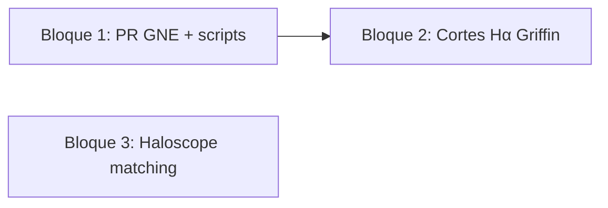

# Plan Cursor: Tarde Taurus — GNE, cortes Hα y Haloscope

| Campo | Valor |
| --- | --- |
| Fecha | 2026-08-25 |
| Estado | planificado |
| Entorno | Cluster Taurus |
| Repos de producto | `get_nebular_emission`, `prep_gne_input`, `run_setup`, `density_field_properties` |

## Objetivo

Cerrar la PR de `get_nebular_emission` (Griffin+19 + luminosidad instantánea), dejar
listos los scripts de preparación y ejecución asociados, aplicar los cortes Hα con
los nuevos datos de Shark y avanzar en la línea Haloscope FastPM (matching y masas).

## Contexto

Tres bloques encadenados por dependencia de datos:

1. **Incongruencias Shark/Galform** — diferencia ~3 magnitudes en cortes por
   tratamiento temporal de AGN (Griffin+19, duty cycle, `f_q`). Código parcial en
   Taurus; falta inspección, commits y PR a Violeta.
2. **Corte Hα Euclid z~1** — cortes acumulados siguiendo Reyes-Peraza y
   `lo2_cum.py`; bloque 5 de la tarea pide recalcular con Griffin + instantaneidad.
3. **Haloscope FastPM** — retomar tras issues abiertas en
   `density_field_properties` (#12–#16); matching UNIT↔FastPM es prerequisito de
   comparación de masas.

### Tareas Notion

| Tarea | Enlace | Estado |
| --- | --- | --- |
| Incongruencias Flujos Shark y Galform | [Notion](https://app.notion.com/p/Incongruencias-Flujos-Shark-y-Galform-3652070c3c2880d091f8f7485d983b01) | En progreso |
| Corte Hα para Euclid en z~1 | [Notion](https://app.notion.com/p/Corte-Halpha-para-Euclid-en-z-1-3092070c3c2880768ea1eea96da7d8a8) | En progreso |
| Investigar Haloscope FastPM | [Notion](https://app.notion.com/p/Investigar-Haloscope-FastPM-39f2070c3c2880fab66dcc655be99ee9) | En progreso |
| Matching halos FastPM ↔ UNIT | [Notion](https://app.notion.com/p/Matching-de-halos-FastPM-UNIT-3ab2070c3c2880cca1c2c1c8a4a8190d) | Sin empezar |
| Comparación masas FastPM vs UNIT | [Notion](https://app.notion.com/p/HALOSCOPE-Estudiar-comparaci-n-de-masas-de-halos-FastPM-vs-UNIT-3ab2070c3c288089814ec11fb2afb7cc) | Sin empezar |

### Specs en este toolkit

- GNE Griffin + `Lagn_insta`: [`docs/get_nebular_emission/gne-griffin-lagn-insta/spec.md`](../../docs/get_nebular_emission/gne-griffin-lagn-insta/spec.md)
- Haloscope FastPM: [`docs/density_field_properties/issue-6-sim-to-fastpm-haloscope/analysis.md`](../../docs/density_field_properties/issue-6-sim-to-fastpm-haloscope/analysis.md)

## Alcance

### Incluido

- Inspección de código en Taurus, commits y PR de `get_nebular_emission`.
- Commits en `prep_gne_input` y `run_setup` alineados con la PR.
- Cortes Hα con datos Griffin + instantaneidad (Shark; Galform si líneas listas).
- Exploración inicial de matching FastPM↔UNIT y notas para calibración de masas.

### Fuera de alcance (esta sesión)

- Ejecución masiva GNE completa (9 snapshots × SU/fnl0/fnl100 × Shark/Galform) si
  la PR aún no está mergeada — se lanza en sesión posterior.
- Resolver issue #12 (tidal anisotropy) en `density_field_properties`.
- Contactar a Adrián (dejar como acción explícita si no hay respuesta hoy).

---

## Plan por bloques (tarde 25 ago 2026)

Estimación total: **~4 h**. Un solo job Slurm activo a la vez (regla del toolkit).

### Bloque 1 — PR `get_nebular_emission` y scripts (19:00–21:00) · Prioridad alta

**Tarea Notion:** [Incongruencias Flujos Shark y Galform](https://app.notion.com/p/Incongruencias-Flujos-Shark-y-Galform-3652070c3c2880d091f8f7485d983b01)

| Paso | Acción | Criterio |
| --- | --- | --- |
| 1.1 | Conectar a Taurus y activar venv del repo `get_nebular_emission` | `git status` limpio o cambios identificados |
| 1.2 | Revisar diff local frente a `develop`/`main`: `gne_Lagn.py`, `gne_griffin.py`, `gne_io.py`, `gne.py` | Alineado con spec Griffin+`Lagn_insta` |
| 1.3 | Ejecutar tests locales: `pytest tests/test_Lagn.py` (y Griffin si existen) | Verde en módulos tocados |
| 1.4 | Crear rama `feature/griffin-lbol-insta` (o equivalente), commit y push | Mensaje en inglés, atómico |
| 1.5 | Abrir PR en `computationalAstroUAM/get_nebular_emission`; asignar revisión a **Violeta** | PR con descripción: modos `Griffin+19`, flag `Lagn_insta`, datasets HDF5 |
| 1.6 | Repetir inspección en `prep_gne_input` y `run_setup`: flags Griffin, snapshots 65–109, SU/fnl0/fnl100 | Commits en rama propia; enlazar PRs en descripción si aplica |

**Puntos de revisión explícitos (de la tarea Notion):**

- SB y HH calculados por separado antes de sumar luminosidad.
- `f_q` / `tau_fold`: documentar valor usado (1 vs 10) en PR y scripts.
- `Lagn_insta=True/False` y salida `L_agn_noinsta` según spec.

**Entregable:** PR(s) abiertas y enlace enviado a Violeta.

---

### Bloque 2 — Cortes Hα con Griffin + instantaneidad (21:00–22:30) · Prioridad alta

**Tarea Notion:** [Corte Hα para Euclid en z~1](https://app.notion.com/p/Corte-Halpha-para-Euclid-en-z-1-3092070c3c2880768ea1eea96da7d8a8)

**Dependencia:** líneas GNE generadas con el flujo Griffin (Bloque 1 o corridas previas en
Taurus para snapshots ya ejecutados: 65, 74, 81, 87, 90, 96, 98, 104, 109).

| Paso | Acción | Criterio |
| --- | --- | --- |
| 2.1 | Verificar que existen `lines.hdf5` Griffin+insta para Shark en snapshots objetivo (mín. iz98 / z≈0.94) | Ficheros en ruta esperada por `run_setup` |
| 2.2 | Adaptar script de cortes acumulados (referencia: [lo2_cum.py](https://github.com/viogp/plots4papers/blob/master/elg_cw_plots/selections/lo2_cum.py)) | Lee Hα atenuado AGN+SFR |
| 2.3 | Calcular cortes de flujo para densidades Tabla 2 Reyes-Peraza en z~1 | Tabla snapshot × SAM × modelo |
| 2.4 | Comparar Shark Griffin+insta vs Galform (mismo snapshot más cercano) | Gráfica n(>F) acumulada; anotar desplazamiento |
| 2.5 | Si desajuste persiste: zoom en zona de interés + interpolación del corte (pendiente Notion §3) | Valor de corte documentado por celda de la tabla |

**Snapshots prioritarios (tabla Notion):**

| Snapshot | z | Notas |
| --- | --- | --- |
| 98 | 0.944 | Principal para z~1 Euclid |
| 90 | 1.321 | Segundo redshift de la tabla |
| 87 | 1.480 | |
| 81 | 1.833 | Shark disponible; Galform parcial |

**Entregable:** tabla de cortes + gráficas acumuladas guardadas en ruta del proyecto;
mensaje breve a Miguel/Nicola si hay valores finales.

---

### Bloque 3 — Haloscope FastPM: matching y masas (22:30–23:30) · Prioridad media

**Tareas Notion:** [Investigar Haloscope FastPM](https://app.notion.com/p/Investigar-Haloscope-FastPM-39f2070c3c2880fab66dcc655be99ee9), [Matching](https://app.notion.com/p/Matching-de-halos-FastPM-UNIT-3ab2070c3c2880cca1c2c1c8a4a8190d), [Comparación masas](https://app.notion.com/p/HALOSCOPE-Estudiar-comparaci-n-de-masas-de-halos-FastPM-vs-UNIT-3ab2070c3c288089814ec11fb2afb7cc)

| Paso | Acción | Criterio |
| --- | --- | --- |
| 3.1 | Revisar estado de catálogos Rockstar FastPM (issue [#5](https://github.com/computationalAstroUAM/density_field_properties/issues/5)) y campo UNIT a=1 | Rutas en `config/fastpm_folders.md` |
| 3.2 | Borrador de script matching: vecino más cercano en (x,y,z), umbral de separación, columnas ID/masa | Script en repo o nota en `notes/analisis/` |
| 3.3 | Métricas básicas: fracción emparejada, distribución de separaciones | Números en nota de sesión |
| 3.4 | Leer apéndice Ramakrishnan (LR vs HR) y anotar si aplica factor de calibración FastPM↔UNIT | Párrafo en nota; issue [#16](https://github.com/computationalAstroUAM/density_field_properties/issues/16) |
| 3.5 | Si tidal anisotropy (#12) sigue roto: no bloquear matching; documentar limitación | Issue referenciada en nota |

**Bloqueante conocido:** `_halo_environment_descriptors.txt` en FastPM vuelca vector
completo en lugar de 8 columnas — no usar para Haloscope hasta fix #12.

**Entregable:** nota de avance con tabla de pares (muestra) o plan documentado si faltan ICs confirmadas con Adrián.

---

## Orden de ejecución y dependencias



- **Bloque 2** puede empezar con líneas ya generadas en Taurus aunque la PR no esté mergeada.
- **Bloque 3** es independiente de GNE; avanzar si el tiempo del Bloque 2 se alarga.

## Comandos de referencia (Taurus)

```bash
# Mutex Slurm — obligatorio antes de sbatch
squeue -u "$USER" -h -o "%i %j %T"

# Tests GNE (local, < 3 min)
cd <get_nebular_emission>
source .venv/bin/activate   # o src/.venv según layout
pytest tests/test_Lagn.py -q

# Estado git en repos de producto
git -C <get_nebular_emission> status && git -C <prep_gne_input> status && git -C <run_setup> status
```

## Criterios de aceptación (sesión)

- [ ] PR `get_nebular_emission` abierta y asignada a Violeta.
- [ ] Commits en `prep_gne_input` y/o `run_setup` pusheados (si hay cambios).
- [ ] Tests `test_Lagn` (mínimo) en verde antes de abrir PR.
- [ ] Cortes Hα Griffin+insta calculados para al menos snapshot 98 (Shark).
- [ ] Nota de avance Haloscope: matching explorado o bloqueos documentados.

## Notas de sesión

| Fecha | Resumen |
| --- | --- |
| 2026-08-25 | Plan creado desde briefing Slack/correo; implementación pendiente en Taurus. |

## Resultado

_Pendiente — completar al cerrar la sesión (enlaces PR, rutas de plots, % matching)._
