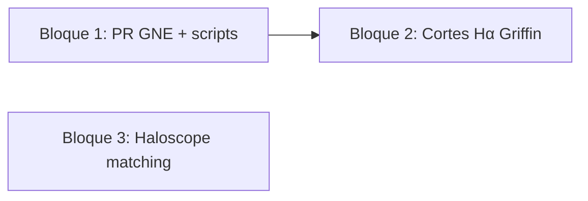

# Plan Cursor: Tarde Taurus — GNE, cortes Hα y Haloscope

| Campo | Valor |
| --- | --- |
| Fecha | 2026-08-25 |
| Estado | planificado |
| Entorno | Cluster Taurus |
| Repos de producto | `get_nebular_emission`, `prep_gne_input`, `run_setup`, `density_field_properties` |

## Objetivo

Cerrar la PR de `get_nebular_emission` (Griffin+19 + luminosidad instantánea), dejar
listos los scripts de preparación y ejecución asociados, aplicar los cortes Hα con
los nuevos datos de Shark y avanzar en la línea Haloscope FastPM (matching y masas).

## Contexto

Tres bloques encadenados por dependencia de datos:

1. **Incongruencias Shark/Galform** — diferencia ~3 magnitudes en cortes por
   tratamiento temporal de AGN (Griffin+19, duty cycle, `f_q`). Código parcial en
   Taurus; falta inspección, commits y PR a Violeta.
2. **Corte Hα Euclid z~1** — cortes acumulados siguiendo Reyes-Peraza y
   `lo2_cum.py`; bloque 5 de la tarea pide recalcular con Griffin + instantaneidad.
3. **Haloscope FastPM** — retomar tras issues abiertas en
   `density_field_properties` (#12–#16); matching UNIT↔FastPM es prerequisito de
   comparación de masas.

### Tareas Notion

| Tarea | Enlace | Estado |
| --- | --- | --- |
| Incongruencias Flujos Shark y Galform | [Notion](https://app.notion.com/p/Incongruencias-Flujos-Shark-y-Galform-3652070c3c2880d091f8f7485d983b01) | En progreso |
| Corte Hα para Euclid en z~1 | [Notion](https://app.notion.com/p/Corte-Halpha-para-Euclid-en-z-1-3092070c3c2880768ea1eea96da7d8a8) | En progreso |
| Investigar Haloscope FastPM | [Notion](https://app.notion.com/p/Investigar-Haloscope-FastPM-39f2070c3c2880fab66dcc655be99ee9) | En progreso |
| Matching halos FastPM ↔ UNIT | [Notion](https://app.notion.com/p/Matching-de-halos-FastPM-UNIT-3ab2070c3c2880cca1c2c1c8a4a8190d) | Sin empezar |
| Comparación masas FastPM vs UNIT | [Notion](https://app.notion.com/p/HALOSCOPE-Estudiar-comparaci-n-de-masas-de-halos-FastPM-vs-UNIT-3ab2070c3c288089814ec11fb2afb7cc) | Sin empezar |

### Specs en este toolkit

- GNE Griffin + `Lagn_insta`: [`docs/get_nebular_emission/gne-griffin-lagn-insta/spec.md`](../../docs/get_nebular_emission/gne-griffin-lagn-insta/spec.md)
- Haloscope FastPM: [`docs/density_field_properties/issue-6-sim-to-fastpm-haloscope/analysis.md`](../../docs/density_field_properties/issue-6-sim-to-fastpm-haloscope/analysis.md)

## Alcance

### Incluido

- Inspección de código en Taurus, commits y PR de `get_nebular_emission`.
- Commits en `prep_gne_input` y `run_setup` alineados con la PR.
- Cortes Hα con datos Griffin + instantaneidad (Shark en `data21/Shark/`; Galform en
  `data21/Galform_to_copy/` vía `euclid_halpha_flux`).
- Exploración inicial de matching FastPM↔UNIT y notas para calibración de masas.

### Fuera de alcance (esta sesión)

- Ejecución masiva GNE completa (9 snapshots × SU/fnl0/fnl100 × Shark/Galform) si
  la PR aún no está mergeada — se lanza en sesión posterior.
- Resolver issue #12 (tidal anisotropy) en `density_field_properties`.
- Contactar a Adrián (dejar como acción explícita si no hay respuesta hoy).

---

## Plan por bloques (tarde 25 ago 2026)

Estimación total: **~4 h**. Un solo job Slurm activo a la vez (regla del toolkit).

### Bloque 1 — PR `get_nebular_emission` y scripts (19:00–21:00) · Prioridad alta

**Tarea Notion:** [Incongruencias Flujos Shark y Galform](https://app.notion.com/p/Incongruencias-Flujos-Shark-y-Galform-3652070c3c2880d091f8f7485d983b01)

| Paso | Acción | Criterio |
| --- | --- | --- |
| 1.1 | Conectar a Taurus y activar venv del repo `get_nebular_emission` | `git status` limpio o cambios identificados |
| 1.2 | Revisar diff local frente a `develop`/`main`: `gne_Lagn.py`, `gne_griffin.py`, `gne_io.py`, `gne.py` | Alineado con spec Griffin+`Lagn_insta` |
| 1.3 | Ejecutar tests locales: `pytest tests/test_Lagn.py` (y Griffin si existen) | Verde en módulos tocados |
| 1.4 | Crear rama `feature/griffin-lbol-insta` (o equivalente), commit y push | Mensaje en inglés, atómico |
| 1.5 | Abrir PR en `computationalAstroUAM/get_nebular_emission`; asignar revisión a **Violeta** | PR con descripción: modos `Griffin+19`, flag `Lagn_insta`, datasets HDF5 |
| 1.6 | Repetir inspección en `prep_gne_input` y `run_setup`: flags Griffin, snapshots 65–109, SU/fnl0/fnl100 | Commits en rama propia; enlazar PRs en descripción si aplica |

**Puntos de revisión explícitos (de la tarea Notion):**

- SB y HH calculados por separado antes de sumar luminosidad.
- `f_q` / `tau_fold`: documentar valor usado (1 vs 10) en PR y scripts.
- `Lagn_insta=True/False` y salida `L_agn_noinsta` según spec.

**Entregable:** PR(s) abiertas y enlace enviado a Violeta.

---

### Bloque 2 — Cortes Hα con Griffin + instantaneidad (21:00–22:30) · Prioridad alta

**Tarea Notion:** [Corte Hα para Euclid en z~1](https://app.notion.com/p/Corte-Halpha-para-Euclid-en-z-1-3092070c3c2880768ea1eea96da7d8a8)

**Objetivo (Notion):** en el snapshot más cercano a z~1, encontrar el **corte de flujo Hα
atenuado** (AGN + SFR) que reproduce la densidad numérica de la **Tabla 2 de
Reyes-Peraza+24** ([MNRAS 529, 3877](https://ui.adsabs.harvard.edu/abs/2024MNRAS.529.3877R/abstract)),
usando funciones acumuladas n(>F) como en
[lo2_cum.py](https://github.com/viogp/plots4papers/blob/master/elg_cw_plots/selections/lo2_cum.py)
(González-Pérez+20, fig. 8).

**Bloque activo en Notion (§5):** recalcular cortes Euclid con **Griffin+19** y
**luminosidad instantánea** (`Lagn_insta=False` en GNE → `agn_data/Lagn` instantánea para
líneas; ver [griffin-lbol-methods.md](../../docs/get_nebular_emission/gne-griffin-lagn-insta/griffin-lbol-methods.md)).
Pendiente de Notion §3: si el corte no ajusta bien → zoom en la zona interesada +
interpolación; consultar a Miguel.

**Dependencia:** `lines.hdf5` generados con GNE en rama `feature/griffin-method-lagn` (PR
[#38](https://github.com/galform/get_nebular_emission/pull/38)) y `run_setup` configurado con
`Lagn_inputs='Griffin+19'`, `Lagn_insta=False`, `tau_fold=1`.

#### Rutas de datos en Taurus (`data21`)

| SAM | Raíz en cluster | Convención de fichero |
| --- | --- | --- |
| Shark | `/data21/users/vgonzalez/Data/Shark/` | `{subtype}/iz{N}/ivol{i}/lines.hdf5` |
| Galform | `/data21/users/vgonzalez/Data/Galform_to_copy/` | idem |

Subtipos: `SU1`, `SU2`, `UNIT1GPC_fnl0`, `UNIT1GPC_fnl100`.

**Nota `fnl100`:** `euclid_halpha_flux` lee snapshot `iz{N-1}` cuando `subtype=UNIT1GPC_fnl100`
(ej. pedir `iz98` → lee `iz97/`).

**Nota Galform:** el driver `flux_cutoff_elg.py` espera carpeta `Galform/` bajo `--data-root`.
Opciones equivalentes:

1. Symlink en Taurus: `ln -s Galform_to_copy /data21/users/vgonzalez/Data/Galform`
2. Ampliar `SAM_TYPES` en `euclid_halpha_flux` para aceptar `Galform_to_copy`

#### Disponibilidad de líneas (tabla Notion, ago 2026)

| Snapshot | z | Shark | Galform | Prioridad |
| --- | --- | --- | --- | --- |
| 98 | 0.944 | SU1/SU2 lines; UNIT prep | SU lines; UNIT prep | **Principal z~1** |
| 90 | 1.321 | lines en los 4 subtipos | lines en los 4 subtipos | Alta |
| 87 | 1.480 | SU lines; UNIT prep | SU lines; UNIT prep | Alta |
| 81 | 1.833 | mezcla prep/lines | mayoría NF | Solo Shark UNIT |
| 78 | 2.020 | SU lines; UNIT parcial | SU lines; UNIT parcial | Baja (z>1.5) |

En `data21` (ago 2026): Shark `UNIT1GPC_fnl0/iz98` tiene `lines.hdf5` recientes (Griffin);
Galform_to_copy tiene árbol completo `iz65–iz109` con `lines.hdf5` en ivols.

#### Repo y salidas del análisis

| Recurso | Ruta Taurus (referencia) |
| --- | --- |
| Repo cortes | `/home/arnes/santiago_arranz/nebular_emission/euclid_halpha_flux` |
| Driver principal | `scripts/flux_cutoff/flux_cutoff_elg.py` |
| Comparación Shark↔Galform | `scripts/flux_cutoff/plot_cumulative_shark_galform_iz97.py` |
| Slurm cortes | `slurm/run_flux_cutoff.slurm` |
| Salida figuras/tablas | `output/plot_lfunction/{Shark|Galform}/` |

El driver escribe: PNG acumulados (L y F), `halpha_density_cutoffs_{sam}_{subtype}.txt`,
catálogos cortados y espectro de potencia por snapshot.

#### Plan de ejecución (orden)

| Paso | Acción | Criterio |
| --- | --- | --- |
| 2.1 | Activar venv de `euclid_halpha_flux`; confirmar symlink `Galform` o parche `Galform_to_copy` | `pytest -q` verde en repo |
| 2.2 | Inventario rápido: para cada snapshot/subtipo objetivo, contar ivols con `lines.hdf5` (64 esperados) | Lista gaps antes de cortes |
| 2.3 | **Si faltan líneas Griffin+insta (Shark):** actualizar `run_gne_shark.py` (`outpath` → `data21`, Griffin+19, `Lagn_insta=False`); lanzar `slurm_hdf5_run.py` solo snapshots/subtipos con gap | Job Slurm activo único; logs en `run_setup/taurus/logs/` |
| 2.4 | **Cortes Shark Griffin+insta** con `flux_cutoff_elg.py` | Ver comandos abajo |
| 2.5 | **Cortes Galform** (mismos snapshots; líneas existentes en `Galform_to_copy`, aún sin Griffin) | Tabla `halpha_density_cutoffs_*.txt` |
| 2.6 | Comparar Shark vs Galform: `plot_cumulative_shark_galform_iz97.py` (adaptar snapshot si ≠ iz97) | PNG comparativos n(>F) y n(>L) |
| 2.7 | Revisar desplazamiento (~3 mag Shark/Galform según tarea incongruencias); zoom (`--cutoff-n-bins-fine 300`, `--cutoff-zoom-bins 2`) | Corte documentado por celda Reyes-Peraza |
| 2.8 | Si desajuste persiste: interpolación manual en zona del corte + nota para Miguel (Notion §3) | Valor de corte anotado en plan/Notion |

**Snapshots CLI** (densidades η de Reyes-Peraza ya en `IZ_DICT` del script):

- Fase 1 (z~1): `iz98` (z=0.944), opcional `iz97` (z=0.987)
- Fase 2: `iz90`, `iz87`
- Fase 3 (si tiempo): `iz81`, `iz78`

**Subtipos fase 1:** `UNIT1GPC_fnl0` (fnl0, como en Notion §3); extender a SU1/SU2 y fnl100
según tabla Notion.

#### Comandos de ejecución (Taurus)

```bash
# Mutex Slurm
squeue -u "$USER" -h -o "%i %j %T"

DATA_ROOT=/data21/users/vgonzalez/Data
REPO=/home/arnes/santiago_arranz/nebular_emission/euclid_halpha_flux
cd "$REPO"
source .venv/bin/activate
export PYTHONPATH="${REPO}/src"
export OMP_NUM_THREADS=16

# Inventario (ejemplo iz98 Shark fnl0)
for i in $(seq 0 63); do
  f="${DATA_ROOT}/Shark/UNIT1GPC_fnl0/iz98/ivol${i}/lines.hdf5"
  test -f "$f" || echo "missing ivol${i}"
done

# Cortes Shark — Griffin+insta, snapshot principal z~1
python scripts/flux_cutoff/flux_cutoff_elg.py \
  --data-root "$DATA_ROOT" \
  --sam-type Shark \
  --subtype UNIT1GPC_fnl0 \
  --snapshots iz98 \
  --output-path output/plot_lfunction/griffin_insta \
  --save-txt

# Cortes Galform (requiere symlink Galform → Galform_to_copy o sam-type extendido)
python scripts/flux_cutoff/flux_cutoff_elg.py \
  --data-root "$DATA_ROOT" \
  --sam-type Galform \
  --subtype UNIT1GPC_fnl0 \
  --snapshots iz98 iz90 iz87 \
  --output-path output/plot_lfunction/griffin_insta

# Comparación acumulada Shark vs Galform (ajustar --data-root y snapshot)
python scripts/flux_cutoff/plot_cumulative_shark_galform_iz97.py \
  --data-root "$DATA_ROOT" \
  --output-path output/plot_lfunction/griffin_insta \
  --subtype UNIT1GPC_fnl0

# Slurm (editar REPO_ROOT y snapshots en slurm/run_flux_cutoff.slurm)
sbatch slurm/run_flux_cutoff.slurm
```

**GNE Shark Griffin (solo si 2.2 detecta gaps):**

```bash
# En run_setup/taurus — outpath en run_gne_shark.py:
#   outpath = '/data21/users/vgonzalez/Data/Shark'
#   Lagn_inputs = 'Griffin+19'
#   Lagn_params = [m_bh, bh_ar_sb, bh_ar_hh, ...]  # columnas Shark
#   Lagn_insta = False
#   tau_fold = 1
cd /path/to/run_setup/taurus
python slurm_hdf5_run.py   # sam=Shark; ampliar runs con iz98, iz90, iz87
```

#### Entregables

- Tabla `halpha_density_cutoffs_{Shark|Galform}_{subtype}.txt` con L y F al nivel η de
  Reyes-Peraza.
- PNG acumulados (luminosidad y flujo atenuado) en `output/plot_lfunction/griffin_insta/`.
- Comparación Shark↔Galform para al menos `iz98` + `UNIT1GPC_fnl0`.
- Mensaje breve a Miguel/Nicola si hay valores finales de corte (Notion §4 histórico).

---

### Bloque 3 — Haloscope FastPM: matching y masas (22:30–23:30) · Prioridad media

**Tareas Notion:** [Investigar Haloscope FastPM](https://app.notion.com/p/Investigar-Haloscope-FastPM-39f2070c3c2880fab66dcc655be99ee9), [Matching](https://app.notion.com/p/Matching-de-halos-FastPM-UNIT-3ab2070c3c2880cca1c2c1c8a4a8190d), [Comparación masas](https://app.notion.com/p/HALOSCOPE-Estudiar-comparaci-n-de-masas-de-halos-FastPM-vs-UNIT-3ab2070c3c288089814ec11fb2afb7cc)

| Paso | Acción | Criterio |
| --- | --- | --- |
| 3.1 | Revisar estado de catálogos Rockstar FastPM (issue [#5](https://github.com/computationalAstroUAM/density_field_properties/issues/5)) y campo UNIT a=1 | Rutas en `config/fastpm_folders.md` |
| 3.2 | Borrador de script matching: vecino más cercano en (x,y,z), umbral de separación, columnas ID/masa | Script en repo o nota en `notes/analisis/` |
| 3.3 | Métricas básicas: fracción emparejada, distribución de separaciones | Números en nota de sesión |
| 3.4 | Leer apéndice Ramakrishnan (LR vs HR) y anotar si aplica factor de calibración FastPM↔UNIT | Párrafo en nota; issue [#16](https://github.com/computationalAstroUAM/density_field_properties/issues/16) |
| 3.5 | Si tidal anisotropy (#12) sigue roto: no bloquear matching; documentar limitación | Issue referenciada en nota |

**Bloqueante conocido:** `_halo_environment_descriptors.txt` en FastPM vuelca vector
completo en lugar de 8 columnas — no usar para Haloscope hasta fix #12.

**Entregable:** nota de avance con tabla de pares (muestra) o plan documentado si faltan ICs confirmadas con Adrián.

---

## Orden de ejecución y dependencias



- **Bloque 2** puede empezar con líneas ya generadas en Taurus aunque la PR no esté mergeada.
- **Bloque 3** es independiente de GNE; avanzar si el tiempo del Bloque 2 se alarga.

## Comandos de referencia (Taurus)

Raíces de datos Euclid (ago 2026):

```bash
SHARK_ROOT=/data21/users/vgonzalez/Data/Shark
GALFORM_ROOT=/data21/users/vgonzalez/Data/Galform_to_copy
DATA_ROOT=/data21/users/vgonzalez/Data   # Shark + symlink Galform → Galform_to_copy
```

```bash
# Mutex Slurm — obligatorio antes de sbatch
squeue -u "$USER" -h -o "%i %j %T"

# Tests GNE (local, < 3 min)
cd <get_nebular_emission>
source .venv/bin/activate   # o src/.venv según layout
pytest tests/test_Lagn.py -q

# Estado git en repos de producto
git -C <get_nebular_emission> status && git -C <prep_gne_input> status && git -C <run_setup> status
```

## Criterios de aceptación (sesión)

- [ ] PR `get_nebular_emission` abierta y asignada a Violeta.
- [ ] Commits en `prep_gne_input` y/o `run_setup` pusheados (si hay cambios).
- [ ] Tests `test_Lagn` (mínimo) en verde antes de abrir PR.
- [ ] Cortes Hα Griffin+insta calculados para al menos snapshot 98 (Shark).
- [ ] Nota de avance Haloscope: matching explorado o bloqueos documentados.

## Notas de sesión

| Fecha | Resumen |
| --- | --- |
| 2026-08-25 | Bloque 1 GNE: PR [#38](https://github.com/galform/get_nebular_emission/pull/38) abierta; spec actualizada en `docs/get_nebular_emission/gne-griffin-lagn-insta/`. |

## Resultado

- **GNE PR:** [galform/get_nebular_emission#38](https://github.com/galform/get_nebular_emission/pull/38) (`feature/griffin-method-lagn` → `main`)
- **Issue:** [galform/get_nebular_emission#37](https://github.com/galform/get_nebular_emission/issues/37)
- **Docs toolkit:** `docs/get_nebular_emission/gne-griffin-lagn-insta/` (spec + `griffin-lbol-methods.md`)
- Cortes Hα y Haloscope: pendientes (bloques 2–3 del plan)
