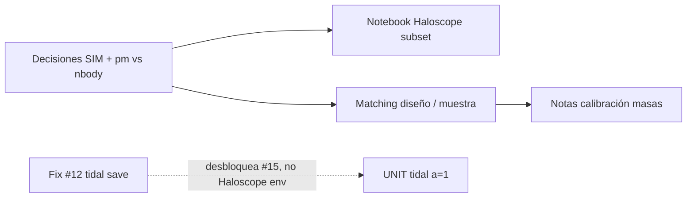

# Plan Cursor: Haloscope FastPM — sesión Taurus

| Campo | Valor |
| --- | --- |
| Fecha | 2026-08-27 |
| Estado | planificado |
| Entorno | Cluster Taurus (sesión interactiva + jobs ligeros) |
| Repo de producto | `density_field_properties` |
| Repo toolkit (notas) | `phd-agents-toolkit` |
| Plan anterior relacionado | [`2026-08-25-tarde-taurus-gne-haloscope.md`](2026-08-25-tarde-taurus-gne-haloscope.md) (bloques 2–3 pendientes) |

---

## Instrucciones para el agente

Eres un agente que trabaja **desde Taurus** (SSH interactivo o sesión en el nodo de login). El usuario abre este plan en el workspace multi-root con `phd-agents-toolkit`.

### Reglas obligatorias

1. **Lee este plan completo** antes de ejecutar nada.
2. **Un solo job Slurm activo** del usuario a la vez (`squeue -u "$USER"`). Si hay jobs en `R`/`PD`, no lances otro hasta que terminen o el usuario lo confirme.
3. **No tumbar el cluster:** evita lecturas masivas de `.list` completos, CIC de campos de densidad, batches de tidal anisotropy ni múltiples `sbatch` encadenados. Usa **subconjuntos** (`n_lines`, `head`, fixtures).
4. **No uses el MCP `taurus` desde el portátil** si el usuario ya está en Taurus; opera con shell en la sesión actual.
5. **Commit/push solo con permiso explícito** del usuario.
6. **Fuera de alcance hoy:** cortes Hα (`euclid_halpha_flux`), PR GNE, correo a Carolina Cuesta (se comenta el lunes con Violeta).

### Rutas en Taurus (referencia)

| Recurso | Ruta |
| --- | --- |
| Repo Haloscope | `/home/arnes/santiago_arranz/density_field_properties` |
| Toolkit (notas) | `/home/arnes/santiago_arranz/phd-agents-toolkit` |
| FastPM Rockstar PM | `/data21/users/mruiz/fastpm_MN5/fastpm_tfm/rockstar_out_pm/out_*.list` |
| FastPM Rockstar nbody | `/data21/users/mruiz/fastpm_MN5/fastpm_tfm/rockstar_out_nbody/out_*.list` |
| Config catálogos | `config/fastpm_folders.md` (dentro del repo) |
| Notebook Haloscope MN5 | `notebooks/SIM_to_FASTPM_unitsim_fastpm_mn5.ipynb` |
| Notebook template | `notebooks/SIM_to_FASTPM_enviarSanti.ipynb` |
| Slurm Haloscope | `slurm/sim_to_fastpm/main_sim_to_fastpm_haloscope.slurm` |
| Salida smoke (si existe) | `output/sim_to_fastpm_haloscope_smoke/` |
| Salida tidal (no usar para Haloscope) | `output/fast_pm_bigfile/tidal_anisotropy/` |

### Documentación de apoyo

- Análisis issue #6: [`docs/density_field_properties/issue-6-sim-to-fastpm-haloscope/analysis.md`](../../docs/density_field_properties/issue-6-sim-to-fastpm-haloscope/analysis.md)
- Skill Slurm: `phd-agents-toolkit/.cursor/skills/slurm-python-jobs/SKILL.md`
- Skill Taurus lectura: `~/.cursor/skills/taurus-cluster/SKILL.md` (solo si el agente está en portátil)

---

## Objetivo de la sesión

Retomar la línea **Haloscope FastPM** tras semanas paradas: cerrar decisiones pendientes, avanzar en el fix de tidal anisotropy (#12), inspeccionar el estado del notebook MN5 y preparar matching UNIT↔FastPM y calibración de masas — **sin jobs pesados**.

Estimación total: **~4 h**. Prioridad: decisiones → fix local #12 → inspección ligera en Taurus → nota de avance.

---

## Contexto y dependencias



| Issue GitHub | Estado | Relación con hoy |
| --- | --- | --- |
| [#5](https://github.com/computationalAstroUAM/density_field_properties/issues/5) Rockstar reader | Cerrada | Reader listo; validar con `head` de `out_8.list` |
| [#6](https://github.com/computationalAstroUAM/density_field_properties/issues/6) SIM→FastPM Haloscope | Abierta | Notebook MN5 + subset |
| [#12](https://github.com/computationalAstroUAM/density_field_properties/issues/12) Tidal output 8 cols | Abierta | **Fix en código + tests** (puede ser en portátil o Taurus) |
| [#13](https://github.com/computationalAstroUAM/density_field_properties/issues/13) E2E Haloscope | Abierta | Después de rerun subset |
| [#14](https://github.com/computationalAstroUAM/density_field_properties/issues/14) R200c vs R200b | Abierta | Solo nota de decisión si hay tiempo |
| [#15](https://github.com/computationalAstroUAM/density_field_properties/issues/15) UNIT tidal a=1 | Abierta | Bloqueada por #12 — no ejecutar hoy |
| [#16](https://github.com/computationalAstroUAM/density_field_properties/issues/16) HMF + ratios | Abierta | Lectura Ramakrishnan + esquema |

### Tareas Notion

| Tarea | Enlace | Estado |
| --- | --- | --- |
| Investigar Haloscope FastPM | [Notion](https://app.notion.com/p/39f2070c3c2880fab66dcc655be99ee9) | En progreso |
| Matching halos FastPM ↔ UNIT | [Notion](https://app.notion.com/p/3ab2070c3c2880cca1c2c1c8a4a8190d) | Sin empezar |
| Comparación masas FastPM vs UNIT | [Notion](https://app.notion.com/p/3ab2070c3c288089814ec11fb2afb7cc) | Sin empezar |

**Bloqueante principal documentado:** falta fijar la **SIM de entrenamiento** (`SIM_PATH`, `hlist`, box). Sin SIM configurada, Haloscope solo puede cargar FastPM; el `fit` no corre.

**No bloqueante para Haloscope `env`:** bug #12 en descriptores tidales. No usar `*_halo_environment_descriptors.txt` hasta el fix.

---

## Alcance

### Incluido

- Mutex Slurm y estado git del repo en Taurus.
- Nota de decisiones (SIM, `rockstar_out_pm` vs `nbody`, `CALIBRATE_MASS`).
- Fix issue #12 + tests (`save_properties` / shapes 1D).
- Inspección del notebook `SIM_to_FASTPM_unitsim_fastpm_mn5.ipynb` (celda config, rutas SIM).
- Rerun Haloscope con **subset** (p. ej. `N_MAX_HALOS=10_000`, `out_8.list`).
- Exploración de matching posicional con muestra pequeña (sin catálogo completo).
- Párrafo sobre calibración de masas (Ramakrishnan) para issue #16.

### Fuera de alcance

- `sbatch` de CIC, tidal anisotropy batch, o Haloscope sobre catálogo completo.
- Matching estadístico definitivo sin confirmar ICs con Adrián.
- Cortes Hα, GNE, correo Carolina Cuesta.
- Resolver #14 en código (solo decisión escrita si hay tiempo).

---

## Plan por bloques

### Bloque 0 — Arranque seguro (10 min) · Obligatorio

| Paso | Acción | Criterio |
| --- | --- | --- |
| 0.1 | `squeue -u "$USER" -h -o "%i %j %T %M"` | Saber si hay jobs activos |
| 0.2 | `cd /home/arnes/santiago_arranz/density_field_properties && git status && git branch --show-current` | Rama y cambios identificados |
| 0.3 | Activar entorno: `source src/.venv/bin/activate` o `conda activate` según layout del repo | `python -c "import density_field_properties"` OK |
| 0.4 | Si hay jobs `flux_cut` u otros pesados en `R`: **no lanzar nada nuevo** sin OK del usuario | Evitar saturar nodo/IP |

```bash
squeue -u "$USER" -h -o "%i %j %T %M"
cd /home/arnes/santiago_arranz/density_field_properties
git status
git branch --show-current
```

---

### Bloque 1 — Decisiones pendientes (30 min) · Prioridad alta

**Tareas Notion:** Matching, Investigar Haloscope FastPM

| Paso | Acción | Criterio |
| --- | --- | --- |
| 1.1 | Leer cabecera de un catálogo FastPM (solo comentarios `#`): `grep '^#' /data21/users/mruiz/fastpm_MN5/fastpm_tfm/rockstar_out_pm/out_8.list \| head -20` | Anotar `Box size`, `Om`, `h` |
| 1.2 | Revisar celda **config** del notebook `SIM_to_FASTPM_unitsim_fastpm_mn5.ipynb` | Listar `SIM_PATH`, `FASTPM_*`, `CALIBRATE_MASS` actuales |
| 1.3 | Buscar candidato SIM en el cluster: `ls` bajo `tutorial_fastpm`, rutas UNIT, o lo que indique el notebook | Ruta candidata o «desconocida → preguntar Adrián» |
| 1.4 | Escribir nota en `notes/analisis/2026-08-27-haloscope-decisiones.md` (toolkit) con tabla de decisiones | Fichero creado con 3 filas mínimas |

**Tabla a rellenar en la nota:**

| Decisión | Opciones | Elegida hoy | Pendiente |
| --- | --- | --- | --- |
| SIM de entrenamiento | UNIT / Illustris CV / otra | | Confirmar con Adrián |
| Catálogo FastPM | `rockstar_out_pm` / `rockstar_out_nbody` | | Violeta / Adrián |
| `CALIBRATE_MASS` | True / False | | Tras ver distribuciones de masa |

**Preguntas para el lunes (Status Violeta):** misma cosmología FastPM↔UNIT, mismas ICs, ruta del `hlist` SIM.

---

### Bloque 2 — Fix issue #12 tidal anisotropy (60–90 min) · Prioridad alta

**Issue:** [#12](https://github.com/computationalAstroUAM/density_field_properties/issues/12)

**Síntoma:** `*_halo_environment_descriptors.txt` con ~10⁵ columnas por fila en lugar de 8.

| Paso | Acción | Criterio |
| --- | --- | --- |
| 2.1 | Inspeccionar `src/density_field_properties/halo_catalog/halo_catalog.py` → `save_properties` | Entender qué se pasa a `np.savetxt` |
| 2.2 | Inspeccionar `halo_environment_descriptors/tidal_anisotropy.py` → shapes de `tidal_anisotropy`, `overdensity` | Deben ser 1D, `len == n_halos` |
| 2.3 | Añadir test en `test_halo_catalog_data.py` o `test_tidal_anisotropy.py` que falle con array 2D y pase con 1D | Test nuevo en rojo→verde |
| 2.4 | Corregir el bug (reshape/squeeze antes de guardar) | `pytest` verde en módulos tocados |
| 2.5 | Verificar con muestra local: `head -3 output/fast_pm_bigfile/tidal_anisotropy/sample_1row_halo_evironment_descriptors.txt` **solo si el fichero es pequeño**; si es enorme, no leer entero | Confirmar síntoma sin `cat` masivo |

```bash
cd /home/arnes/santiago_arranz/density_field_properties/src
source ../src/.venv/bin/activate 2>/dev/null || true
pytest tests/halo_catalog/test_halo_catalog_data.py tests/halo_environment_descriptors/test_tidal_anisotropy.py -q
```

**Entregable:** rama `fix/12-tidal-descriptor-columns` (o commit en rama actual) + tests. No abrir PR sin permiso del usuario.

---

### Bloque 3 — Estado Haloscope notebook (45 min) · Prioridad media

**Issue:** [#6](https://github.com/computationalAstroUAM/density_field_properties/issues/6)

| Paso | Acción | Criterio |
| --- | --- | --- |
| 3.1 | Abrir `notebooks/SIM_to_FASTPM_unitsim_fastpm_mn5.ipynb`; comparar con `SIM_to_FASTPM_enviarSanti.ipynb` | Diff mental: ¿`load_fastpm` usa Rockstar? |
| 3.2 | Comprobar si existe salida previa: `ls -lh output/sim_to_fastpm_haloscope_smoke/` | Registrar parquet/fecha/tamaño |
| 3.3 | Si `SIM_PATH` vacío o inválido: documentar en nota de decisiones | Mensaje claro al usuario |
| 3.4 | Si SIM está configurada: ejecutar notebook **solo celdas de carga** con `n_lines=5000` o `N_MAX_HALOS=10000` | Carga sin OOM |
| 3.5 | Si carga OK: ejecutar `fit`+`predict` en subset; guardar en `output/sim_to_fastpm_haloscope_smoke/` | Parquet o CSV de prueba |

```bash
cd /home/arnes/santiago_arranz/density_field_properties
ls -lh output/sim_to_fastpm_haloscope_smoke/ 2>/dev/null || echo "no smoke dir"
grep '^#' /data21/users/mruiz/fastpm_MN5/fastpm_tfm/rockstar_out_pm/out_8.list | head -20
```

**Preferir Jupyter en nodo de login** con subset. Solo `sbatch slurm/sim_to_fastpm/main_sim_to_fastpm_haloscope.slurm` si:

- `squeue` vacío para el usuario,
- el script ya limita `N_MAX_HALOS`,
- el usuario lo aprueba explícitamente.

---

### Bloque 4 — Matching FastPM ↔ UNIT, exploración (45 min) · Prioridad media

**Tarea Notion:** [Matching de halos FastPM ↔ UNIT](https://app.notion.com/p/3ab2070c3c2880cca1c2c1c8a4a8190d)

| Paso | Acción | Criterio |
| --- | --- | --- |
| 4.1 | Localizar catálogo UNIT a z=1 / a=1 (ruta en notebook, `output/unit_files/`, o preguntar al usuario) | Ruta anotada |
| 4.2 | Cargar **solo 5000 halos** de FastPM (`out_8.list`) y UNIT con `RockstarCatalogReader(n_lines=5000)` | Dos DataFrames en memoria |
| 4.3 | Prototipo vecino más cercano periódico (KD-tree); umbral tentativo 1 Mpc/h | Script en `scripts/` o celda en notebook de exploración |
| 4.4 | Métricas: fracción emparejada, histograma de separaciones | Números en nota `notes/analisis/2026-08-27-haloscope-matching-muestra.md` |

**Si ICs no confirmadas:** parar en 4.2 y documentar «matching exploratorio no vinculante».

**No usar** el pipeline de `fnl_matching_error_reduction` hoy (es matching espectro de potencias SAM↔FastPM, distinto objetivo).

---

### Bloque 5 — Calibración de masas (30 min) · Prioridad baja

**Tarea Notion:** [Comparación masas FastPM vs UNIT](https://app.notion.com/p/3ab2070c3c288089814ec11fb2afb7cc) · Issue [#16](https://github.com/computationalAstroUAM/density_field_properties/issues/16)

| Paso | Acción | Criterio |
| --- | --- | --- |
| 5.1 | Localizar en Ramakrishnan et al. 2024 (Haloscope paper) el apéndice LR vs HR | Párrafo resumen en nota |
| 5.2 | Esbozar si aplica factor de escala FastPM↔UNIT antes de comparar M200b | Bullet list en misma nota |
| 5.3 | Listar los cuatro catálogos para HMF (#16): UNIT, FastPM FoF, RockstarPM, RockstarNBody | Tabla de rutas (aunque falten algunas) |

**Entregable:** `notes/analisis/2026-08-27-haloscope-mass-calibration.md` (borrador).

---

## Comandos de referencia

```bash
# Mutex — siempre primero
squeue -u "$USER" -h -o "%i %j %T %M"

# Repo
REPO=/home/arnes/santiago_arranz/density_field_properties
cd "$REPO"
git status && git branch --show-current

# Entorno (ajustar si el venv está en otra ruta)
source src/.venv/bin/activate
export PYTHONPATH="${REPO}/src:${PYTHONPATH}"

# Tests tras fix #12
pytest tests/halo_catalog/test_halo_catalog_data.py \
       tests/halo_environment_descriptors/test_tidal_anisotropy.py -q

# Cabecera Rockstar sin cargar catálogo entero
FASTPM_LIST=/data21/users/mruiz/fastpm_MN5/fastpm_tfm/rockstar_out_pm/out_8.list
grep '^#' "$FASTPM_LIST" | head -20

# Contar líneas de datos (ligero)
grep -v '^#' "$FASTPM_LIST" | wc -l
```

---

## Criterios de aceptación (fin de sesión)

- [ ] `squeue` revisado; ningún job pesado lanzado sin control.
- [ ] Nota `2026-08-27-haloscope-decisiones.md` con SIM / pm vs nbody / `CALIBRATE_MASS`.
- [ ] Issue #12: fix + tests en verde (aunque sin PR).
- [ ] Estado del notebook MN5 documentado (config, smoke output, bloqueo SIM si aplica).
- [ ] Matching exploratorio con muestra pequeña **o** limitación ICs documentada.
- [ ] Borrador nota calibración masas (Ramakrishnan).
- [ ] Tabla «Notas de sesión» al final de este plan actualizada.

---

## Notas de sesión

| Hora | Bloque | Resumen | Bloqueos |
| --- | --- | --- | --- |
| | 0 | | |
| | 1 | | |
| | 2 | | |
| | 3 | | |
| | 4 | | |
| | 5 | | |

---

## Resultado (rellenar al cerrar)

- **Decisiones:** …
- **Fix #12:** rama/commit …
- **Haloscope subset:** salida en …
- **Matching muestra:** fracción emparejada …
- **Siguiente sesión:** …
