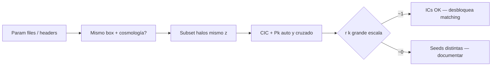

# Plan Cursor: verificación ICs FastPM ↔ UNIT — sesión Taurus

| Campo | Valor |
| --- | --- |
| Fecha | 2026-08-31 |
| Estado | planificado |
| Entorno | Cluster Taurus (SSH interactivo; job Slurm opcional y ligero) |
| Repo de producto | `density_field_properties` |
| Repo toolkit (notas) | `phd-agents-toolkit` |
| Tarea Notion | [Matching de halos FastPM ↔ UNIT](https://app.notion.com/p/3ab2070c3c2880cca1c2c1c8a4a8190d) |
| Plan relacionado | [`2026-08-27-haloscope-taurus.md`](2026-08-27-haloscope-taurus.md) |

---

## Instrucciones para el agente

Eres un agente que trabaja **desde Taurus** (SSH interactivo o sesión en el nodo de login). El usuario abre este plan en el workspace multi-root con `phd-agents-toolkit`.

### Reglas obligatorias

1. **Lee este plan completo** antes de ejecutar nada.
2. **Un solo job Slurm activo** del usuario a la vez (`squeue -u "$USER"`). Si hay jobs en `R`/`PD`, no lances otro hasta que terminen o el usuario lo confirme.
3. **No tumbar el cluster:** no cargues catálogos `.list` completos ni hagas CIC a 512³ o más sin subset. Usa `n_lines`, filtros de masa o muestreo aleatorio.
4. **No uses el MCP `taurus` desde el portátil** si el usuario ya está en Taurus; opera con shell en la sesión actual.
5. **Commit/push solo con permiso explícito** del usuario.
6. **No implementes matching 1-1** en esta sesión; solo verificación de ICs/semilla.

### Rutas en Taurus (referencia)

| Recurso | Ruta |
| --- | --- |
| Repo Haloscope | `/home/arnes/santiago_arranz/density_field_properties` |
| Toolkit (notas) | `/home/arnes/santiago_arranz/phd-agents-toolkit` |
| FastPM Rockstar PM | `/data21/users/mruiz/fastpm_MN5/fastpm_tfm/rockstar_out_pm/out_8.list` |
| FastPM Rockstar nbody | `/data21/users/mruiz/fastpm_MN5/fastpm_tfm/rockstar_out_nbody/out_8.list` |
| UNIT Rockstar (confirmado Adrián) | `/data21/UNITSIM/fixedAmp_InvPhase_001/ROCKSTAR` |
| Tutorial FastPM (param files) | `/home/adrian/UNIT_PNG/tutorial_fastpm/` |
| Salida de esta sesión | `phd-agents-toolkit/notes/analisis/2026-08-31-fastpm-unit-seed-check.md` |

### Documentación de apoyo

- Confirmación Adrián (31 ago 2026): DM Slack Cosmology-UAM — mismas seeds; UNIT = `fixedAmp_InvPhase_001`.
- Nota calibración masas: [`notes/analisis/2026-08-27-haloscope-mass-calibration.md`](../analisis/2026-08-27-haloscope-mass-calibration.md)
- Reader Rockstar: `density_field_properties.halo_catalog.rockstar.RockstarCatalogReader`
- Pylians P(k) halos (referencia en otro repo): `fnl_matching.power_spectrum.get_pk_halos`

---

## Objetivo de la sesión

**Verificar que FastPM MN5 y UNIT `fixedAmp_InvPhase_001` comparten la misma semilla/ICs**, siguiendo el criterio de Adrián:

- Calcular **cross power spectrum** de halos (o coeficiente de correlación)
  `r(k) = xPk / sqrt(Pk_UNIT × Pk_FastPM)`
- **r(k) ≈ 1** a grandes escalas → ICs compatibles
- **r(k) ≈ 0** → seeds distintas

Complementar con comprobación de **parameter files** y cabeceras Rockstar (box, cosmología).

Estimación total: **~2 h**. Prioridad: rutas → headers → cross-P(k) en subset → nota de avance.

---

## Contexto



| Fuente | Qué dice |
| --- | --- |
| Adrián (Slack, 31 ago) | FastPM en `fastpm_MN5/fastpm_tfm/` = UNIT 4096 `fixedAmp_InvPhase_001` |
| Adrián | Matching requiere mismas seeds; UNIT sin particle IDs |
| Adrián | Verificar con r(k) antes del matching 1-1 |
| Notion tarea matching | Subtarea activa: **Verificar ICs con r(k)** |

**Hipótesis de trabajo:** snapshot FastPM `out_8.list` ≈ z ≈ 1. Hay que localizar el snapshot UNIT equivalente bajo `ROCKSTAR/` (p. ej. `out_*.list` o estructura por redshift).

---

## Alcance

### Incluido

- Comprobar que existen rutas FastPM y UNIT.
- Leer cabeceras Rockstar (`grep '^#'`) y anotar `Box size`, `h`, `Omega_m`, etc.
- Buscar y comparar parameter files (seed, `IC`, `box`, cosmología) en directorios FastPM y UNIT.
- Localizar snapshot UNIT al mismo redshift que `out_8`.
- Cross-P(k) en **subset** de halos (p. ej. 50k–200k por catálogo, o `M200b` mínima).
- Figura `r(k)` y tabla resumen en nota Markdown.
- Actualizar subtarea Notion «Verificar ICs» con resultado.

### Fuera de alcance

- Matching halo a halo (siguiente sesión).
- Catálogo completo o CIC a grid > 256³ sin aprobación.
- `sbatch` pesado salvo que el subset no quepa en memoria del nodo de login.
- Decidir `rockstar_out_pm` vs `nbody` (usar **PM** salvo que falle la verificación; repetir con nbody solo si hace falta).

---

## Criterios de aceptación

| Criterio | Umbral |
| --- | --- |
| Headers | Mismo `Box size` (±0.1%) y cosmología consistente |
| Param files | Misma convención de seed/phase (`fixedAmp`, `InvPhase_001`, etc.) |
| r(k) a k bajos | mediana r(k) > **0.9** en bins con k < 0.05 h/Mpc (ajustar si box distinto) |
| r(k) seeds distintas | mediana r(k) ≈ 0 en mismos bins → **ICs NO compatibles** |
| Entregable | Nota `2026-08-31-fastpm-unit-seed-check.md` + Notion actualizado |

Si headers/param files discrepan, **parar** y documentar sin forzar el cross-P(k).

---

## Plan por bloques

### Bloque 0 — Arranque (10 min)

| Paso | Acción | Criterio |
| --- | --- | --- |
| 0.1 | `squeue -u "$USER"` | Sin jobs pesados inesperados |
| 0.2 | Comprobar rutas FastPM y UNIT (`ls`, `test -f`) | Rutas existen o anotar alternativa |
| 0.3 | Activar venv y `PYTHONPATH` | Import de `density_field_properties` OK |

```bash
squeue -u "$USER" -h -o "%i %j %T %M"
REPO=/home/arnes/santiago_arranz/density_field_properties
TOOLKIT=/home/arnes/santiago_arranz/phd-agents-toolkit
cd "$REPO"
source src/.venv/bin/activate
export PYTHONPATH="${REPO}/src:${PYTHONPATH}"

FASTPM_LIST=/data21/users/mruiz/fastpm_MN5/fastpm_tfm/rockstar_out_pm/out_8.list
UNIT_ROCKSTAR=/data21/UNITSIM/fixedAmp_InvPhase_001/ROCKSTAR

test -f "$FASTPM_LIST" && echo "FastPM OK" || echo "FastPM MISSING"
ls -la "$UNIT_ROCKSTAR" | head -20
```

---

### Bloque 1 — Headers y parameter files (25 min)

| Paso | Acción | Criterio |
| --- | --- | --- |
| 1.1 | `grep '^#' "$FASTPM_LIST" \| head -30` | Tabla box, h, Om |
| 1.2 | Listar snapshots UNIT: `ls "$UNIT_ROCKSTAR"` | Identificar fichero z ≈ 1 |
| 1.3 | `grep '^#'` del `.list` UNIT elegido | Mismos parámetros que FastPM |
| 1.4 | Buscar param files FastPM bajo `fastpm_MN5/` y `tutorial_fastpm/` | `grep -iE 'seed\|IC\|box\|omega'` |
| 1.5 | Buscar metadata UNIT bajo `fixedAmp_InvPhase_001/` | Misma seed/phase si está documentada |

**Preguntas a resolver:**

- ¿Qué `out_*.list` de UNIT corresponde a `out_8` de FastPM?
- ¿Box 1 Gpc/h en ambos?
- ¿Aparece `fixedAmp_InvPhase_001` (o equivalente) en ambos lados?

Anotar en la nota de salida antes de seguir.

---

### Bloque 2 — Subset de halos (20 min)

| Paso | Acción | Criterio |
| --- | --- | --- |
| 2.1 | Cargar FastPM con `RockstarCatalogReader.read_catalog(path, n_lines=...)` o script propio | DataFrame/array con x,y,z |
| 2.2 | Cargar UNIT equivalente, **mismo criterio de selección** | Mismo número de halos ±10% |
| 2.3 | Filtrar `pid == -1` si la columna está disponible | Solo halos centrales |
| 2.4 | Opcional: cortar por `M200b > 5×10¹⁰ Msun/h` | Reduce ruido de subestructura |

**Parámetros sugeridos (empezar conservador):**

| Parámetro | Valor inicial |
| --- | --- |
| `N_HALOS` | 100_000 (o `n_lines` equivalente) |
| `N_GRID` | 128 |
| `MAS` | CIC |
| `BOX_SIZE` | leer de cabecera Rockstar (Mpc/h) |

Snippet de referencia (adaptar en script/notebook):

```python
from density_field_properties.halo_catalog.rockstar import RockstarCatalogReader

fastpm = RockstarCatalogReader.read_catalog(FASTPM_LIST, n_lines=100_000)
unit = RockstarCatalogReader.read_catalog(UNIT_LIST, n_lines=100_000)

pos_fastpm = fastpm.data[:, [1, 2, 3]]  # ajustar índices si el reader devuelve otro layout
pos_unit = unit.data[:, [1, 2, 3]]
```

Verificar en Taurus el layout exacto de `HaloCatalogData` antes de indexar.

---

### Bloque 3 — Cross power spectrum y r(k) (45–60 min)

| Paso | Acción | Criterio |
| --- | --- | --- |
| 3.1 | Construir δ_halo (CIC) para FastPM y UNIT con **mismo** `N_GRID`, `BOX_SIZE`, `MAS` | Cubos float32, mean=1 tras normalizar |
| 3.2 | Calcular Pk auto: `PKL.Pk(delta, BoxSize, ...)` | k, Pk_FastPM, Pk_UNIT |
| 3.3 | Calcular cross-Pk: `PKL.XPk(delta_fastpm, delta_unit, BoxSize, ...)` | k, xPk |
| 3.4 | `r(k) = xPk / sqrt(Pk_UNIT * Pk_FastPM)` | Array r(k) |
| 3.5 | Plot r(k) vs k; línea horizontal en 1 | Guardar en `output/fastpm_unit_seed_check/` |
| 3.6 | Repetir con `N_GRID=256` si memoria permite | Robustez (opcional) |

**Dependencias Pylians** (comprobar en venv de Taurus):

```python
import MAS_library as MASL
import Pk_library as PKL
import numpy as np

# delta_fastpm, delta_unit: cubes (N_GRID, N_GRID, N_GRID)
pk_f = PKL.Pk(delta_fastpm, BOX_SIZE, 0, "CIC", 64, False)
pk_u = PKL.Pk(delta_unit, BOX_SIZE, 0, "CIC", 64, False)
xpk = PKL.XPk(delta_fastpm, delta_unit, BOX_SIZE, 0, "CIC", 64, False)

k = pk_f.k3D
r = xpk.Pk[:, 0] / np.sqrt(pk_f.Pk[:, 0] * pk_u.Pk[:, 0])
```

Si `PKL.XPk` no está disponible, alternativa mínima:

1. FFT de ambos campos → `δ̂₁`, `δ̂₂`
2. `xPk = mean(Re(δ̂₁* δ̂₂))` en bins de |k|
3. Normalizar con autospectros

**Interpretación:**

- Mismas ICs: r(k) → 1 para k ≪ k_Nyquist (modos grandes alineados).
- Seeds distintas: r(k) ≈ 0 (fases no coherentes).
- Solver PM distinto puede bajar r(k) a k altos **sin** invalidar ICs; el diagnóstico es a **grandes escalas**.

---

### Bloque 4 — Documentar y cerrar (20 min)

| Paso | Acción | Criterio |
| --- | --- | --- |
| 4.1 | Escribir `notes/analisis/2026-08-31-fastpm-unit-seed-check.md` | Tabla rutas, headers, r(k), veredicto |
| 4.2 | Guardar figura y CSV de r(k) | Ruta en la nota |
| 4.3 | Actualizar Notion tarea matching | Subtarea «Verificar ICs» marcada; veredicto en cuerpo |
| 4.4 | Si ICs OK: anotar snapshot UNIT definitivo para matching | Desbloquea siguiente sesión |

**Plantilla de veredicto (rellenar):**

```markdown
## Veredicto

- **ICs compatibles:** SÍ / NO / INCONCLUSO
- **Evidencia:** r(k) mediana = … en k < … h/Mpc; headers …
- **Snapshot UNIT usado:** …
- **Siguiente paso:** matching por proximidad / escalar a Adrián
```

---

## Script sugerido (crear si no existe)

Ubicación propuesta: `density_field_properties/scripts/verify_fastpm_unit_ics.py`

El agente puede implementarlo en esta sesión **solo si el usuario lo aprueba** (evitar commit sin permiso). Alternativa: notebook exploratorio en `notebooks/` o celdas en sesión interactiva.

Argumentos CLI mínimos:

```text
--fastpm-list PATH
--unit-list PATH
--box-size FLOAT
--n-halos INT
--n-grid INT
--output-dir PATH
```

Salida: `r_k.csv`, `r_k.png`, `summary.json`.

---

## Comandos de referencia

```bash
REPO=/home/arnes/santiago_arranz/density_field_properties
TOOLKIT=/home/arnes/santiago_arranz/phd-agents-toolkit
cd "$REPO"
source src/.venv/bin/activate
export PYTHONPATH="${REPO}/src:${PYTHONPATH}"

FASTPM_LIST=/data21/users/mruiz/fastpm_MN5/fastpm_tfm/rockstar_out_pm/out_8.list
UNIT_BASE=/data21/UNITSIM/fixedAmp_InvPhase_001/ROCKSTAR

grep '^#' "$FASTPM_LIST" | head -30
ls -lh "$UNIT_BASE"
find /data21/users/mruiz/fastpm_MN5 -iname '*.param' -o -iname '*param*' 2>/dev/null | head -10
find /data21/UNITSIM/fixedAmp_InvPhase_001 -maxdepth 2 -type f 2>/dev/null | head -20

mkdir -p output/fastpm_unit_seed_check
```

---

## Criterios de aceptación (fin de sesión)

- [ ] Rutas FastPM y UNIT confirmadas; snapshot UNIT a z ≈ 1 identificado.
- [ ] Tabla comparativa de headers (box, h, cosmología).
- [ ] Parameter files revisados (seed/phase anotados).
- [ ] r(k) calculado en subset y figura guardada.
- [ ] Veredicto explícito: ICs compatibles / no / inconcluso.
- [ ] Nota `2026-08-31-fastpm-unit-seed-check.md` creada.
- [ ] Notion actualizado (subtarea verificación ICs).
- [ ] Tabla «Notas de sesión» al final de este plan actualizada.

---

## Notas de sesión

| Hora | Bloque | Resumen | Bloqueos |
| --- | --- | --- | --- |
| | 0 | | |
| | 1 | | |
| | 2 | | |
| | 3 | | |
| | 4 | | |

---

## Resultado (rellenar al cerrar)

- **Snapshot UNIT:** …
- **Headers:** box = …, h = …, Om = …
- **r(k) grandes escalas:** …
- **Veredicto ICs:** …
- **Siguiente sesión:** matching por proximidad / …
