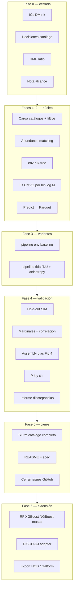
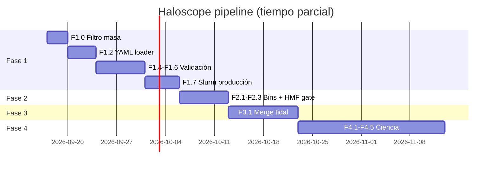

# Plan: implementación completa del pipeline Haloscope SIM → FastPM

| Campo | Valor |
| --- | --- |
| Fecha | 2026-09-17 |
| Estado | Fase 0 cerrada — Fase 1 en curso |
| Repo producto | `density_field_properties` |
| Repo notas | `phd-agents-toolkit` |
| Artículo | I — Haloscope en simulaciones aproximadas (plan de tesis) |
| Referencia | Ramakrishnan et al. 2025 (A&A 697, A70) |
| Decisiones Fase 0 | [`2026-09-17-haloscope-phase0-decisions.md`](2026-09-17-haloscope-phase0-decisions.md) |
| Config 1ª corrida | `density_field_properties/config/haloscope_run.yaml` |

---

## 1. Objetivo

Pipeline reproducible que:

1. Entrena **Haloscope** (CMVG) en halos **UNIT** (HR, hlist).
2. Enriquece catálogos **FastPM Rockstar** (LR) con `cv`, `Spin`, `ca`, `ba`.
3. Calibra masas (`CALIBRATE_MASS`) cuando la HMF lo exige.
4. Valida científicamente frente a UNIT (distribuciones, correlaciones, P(k), assembly bias).
5. Admite **configuración editable** (SIM, FastPM, snapshot, filtros, calibración).

**Primera corrida:** ver decisiones Fase 0 (nbody, z=0, centrales+20 m_p en SIM, abundance matching).

---

## 2. Arquitectura



---

## 3. Estado actual del código (2026-09-17)

| Módulo | Ruta | Estado |
| --- | --- | --- |
| CMVG Haloscope | `haloscope/haloscope.py` | ✅ vendored |
| Pipeline env | `haloscope/sim_to_fastpm/pipeline.py` | ✅ smoke OK |
| Carga catálogos | `load_catalogs.py` | ✅ sin corte 20 m_p en pipeline |
| Entorno | `environment.py` | ✅ |
| Masas | `mass_matching.py` | ✅ abundance matching |
| Entrenamiento | `training.py` | ✅ sin export métricas/PDFs |
| Assembly bias | `assembly_bias.py`, `plotting.py` | ✅ no cableado al pipeline env |
| Config | `config.py` | ✅ default nbody; sin YAML loader |
| CLI env | `scripts/run_sim_to_fastpm_haloscope.py` | ✅ |
| Slurm env | `slurm/sim_to_fastpm/main_sim_to_fastpm_haloscope.slurm` | ✅ no ejecutado full |
| IC check | `scripts/verify_fastpm_unit_ics.py` | ✅ DM mode PASS |
| Pipeline tidal | `pipeline_tidal.py`, `tidal_features.py` | 🟡 working tree Taurus, sin merge |
| YAML config | `config/haloscope_run.yaml` | ✅ sin loader en código |

---

## 4. Fases e issues

### Fase 0 — Preflight ✅ CERRADA

| ID | Tarea | Estado |
| --- | --- | --- |
| H0.1 | Decisiones catálogo, filtros, CALIBRATE_MASS | ✅ [`phase0-decisions`](2026-09-17-haloscope-phase0-decisions.md) |
| H0.2 | ICs DM r(k) | ✅ `output/fastpm_unit_seed_check_dm/` |
| H0.3 | HMF → calibrar masas | ✅ abundance matching |
| H0.4 | Nota alcance verificaciones | ✅ §4 en decisions |

**GitHub:** #5 (reader) cerrada; #16 (HMF) diagnóstico hecho, integración en preflight pendiente F1.x.

---

### Fase 1 — Pipeline `env` production-ready 🔄 EN CURSO

| ID | Tarea | Repo | Estado |
| --- | --- | --- | --- |
| F1.0 | Filtro `M ≥ 20 m_p` en carga SIM y FastPM | `load_catalogs.py`, `pipeline.py` | ❌ |
| F1.1 | Default `rockstar_out_nbody` | `config.py` | ✅ |
| F1.2 | Loader `haloscope_run.yaml` + CLI `--config` | nuevo `run_config.py` o similar | ❌ |
| F1.3 | Confirmar hlist en Taurus (`data21` / `data5`) | operativo | 🟡 |
| F1.4 | Hold-out: KS/MAE + corner PDF | `validation.py`, `plotting.py` | ❌ |
| F1.5 | Marginales + matriz correlación post-enrich | `validation.py` | ❌ |
| F1.6 | Export CMVG por bin (`models/bin_*.pkl`) | `training.py` | ❌ |
| F1.7 | Slurm producción catálogo completo | `slurm/sim_to_fastpm/` | ❌ |
| F1.8 | Test integración fixtures sintéticos (CI) | `tests/haloscope/` | ❌ |

**Issue GitHub:** #6 SIM→FastPM Haloscope.

**Criterio de cierre Fase 1:** Parquet enriquecido full + JSON métricas + PDFs hold-out y marginales.

```bash
# Smoke (hoy)
cd density_field_properties && export PYTHONPATH=src
python scripts/run_sim_to_fastpm_haloscope.py \
  --fastpm-list /data21/users/mruiz/fastpm_MN5/fastpm_tfm/rockstar_out_nbody/out_8.list \
  --max-sim-halos 8000 --max-fastpm-halos 8000 --min-bin-size 5

# Producción (objetivo Fase 1)
python scripts/run_sim_to_fastpm_haloscope.py \
  --config config/haloscope_run.yaml \
  --max-sim-halos 0 --max-fastpm-halos 0 --min-bin-size 10
```

---

### Fase 2 — Bins de masa y calibración avanzada

| ID | Tarea | Estado |
| --- | --- | --- |
| F2.1 | Bins log M según Ramakrishnan Ap. D (parametrizable) | ❌ |
| F2.2 | Diagnósticos abundance matching (CDF antes/después) | ❌ |
| F2.3 | Integrar HMF preflight como paso automático antes de enrich | ❌ |
| F2.4 | Documentar en spec que Haloscope no modifica M200b de salida | ❌ |

**Issue GitHub:** #16 (ratios HMF en pipeline).

---

### Fase 3 — Variante tidal + assembly bias

| ID | Tarea | Estado |
| --- | --- | --- |
| F3.1 | Merge `pipeline_tidal.py`, `tidal_features.py` desde Taurus | ❌ |
| F3.2 | Validar índices `T/|U|` FastPM vs UNIT | ❌ |
| F3.3 | Fix descriptores 8 columnas (#12) en producción | 🟡 fix en rama |
| F3.4 | Cablear assembly bias Fig.4 al pipeline | ❌ |
| F3.5 | Unificar `INPUT_FEATURES` (env / tidal / ambos) | ❌ |

**Referencias:** [`2026-08-31-issue-13-haloscope-e2e-progress.md`](2026-08-31-issue-13-haloscope-e2e-progress.md).

**Issue GitHub:** #12, #13, #15 (UNIT tidal a=1).

---

### Fase 4 — Validación científica (Artículo I)

| ID | Métrica | Referencia paper |
| --- | --- | --- |
| F4.1 | b₁(M) + tails assembly bias | Ramakrishnan Fig. 4 |
| F4.2 | P(k) halos, k < 0.1 h/Mpc⁻¹ | Artículo I + Adame 4.1 |
| F4.3 | ξ(r) | Artículo I |
| F4.4 | Covarianzas P(k) o counts | Artículo I |
| F4.5 | `haloscope_validation_report.py` → HTML/PDF | Criterio publicación |
| F4.6 | Matching posicional subset (scatter M200b) | Diagnóstico; ICs OK |

**Umbrales orientativos (validar con dirección):** KS p > 0.01 o Δ median < 10%; |Δρ| < 0.1; |ΔP/P| < 15% en k < 0.1.

---

### Fase 5 — Producción, docs y cierre issues

| ID | Tarea |
| --- | --- |
| F5.1 | `docs/haloscope/spec.md` en repo producto (requisitos R1–Rn) — o enlace a este plan |
| F5.2 | README usuario: preflight → smoke → production → validation |
| F5.3 | Multi-snapshot (z=0 y otros snaps parametrizados) |
| F5.4 | Cerrar #6, #13, #16 con checklist |
| F5.5 | Archivar artefactos `output/haloscope_production_v1/` |

---

### Fase 6 — Extensiones (post Artículo I)

| ID | Tarea |
| --- | --- |
| H6-ML-mass | RF / XGBoost / NGBoost M200b (Ap. C Ramakrishnan) |
| H6-pm-baseline | Sensibilidad softening pm vs nbody |
| H6-DISCO-DJ | Adapter catálogo simulación GPU |
| H6-downstream | Schema export HOD / Galform / SHARK |

---

## 5. Configuración editable (requisito transversal)

El pipeline debe leer (YAML + overrides CLI):

| Parámetro | 1ª corrida | CLI override |
| --- | --- | --- |
| `sim.root` / `sim.hlist` | UNIT fixedAmp_InvPhase_001 | `--sim-hlist` |
| `fastpm.rockstar_dir` / `list_name` | nbody / `out_8.list` | `--fastpm-list` |
| `sample.central_only_sim` | true | flag |
| `sample.min_m200b_times_mp` | 20 | flag |
| `haloscope.calibrate_mass` | true | flag |
| `haloscope.input_features` | `env` | futuro |
| `output.dir` | `output/sim_to_fastpm_haloscope` | `--output-dir` |

Implementación: **F1.2** (Fase 1).

---

## 6. Mapa issues GitHub ↔ fases

| Issue | Título | Fase |
| --- | --- | --- |
| [#5](https://github.com/computationalAstroUAM/density_field_properties/issues/5) | Rockstar reader | ✅ cerrada |
| [#6](https://github.com/computationalAstroUAM/density_field_properties/issues/6) | SIM→FastPM Haloscope | 1 |
| [#12](https://github.com/computationalAstroUAM/density_field_properties/issues/12) | Tidal 8 cols | 3 |
| [#13](https://github.com/computationalAstroUAM/density_field_properties/issues/13) | E2E tidal | 3 |
| [#14](https://github.com/computationalAstroUAM/density_field_properties/issues/14) | R200c vs R200b | decisión; no bloquea v1 |
| [#15](https://github.com/computationalAstroUAM/density_field_properties/issues/15) | UNIT tidal a=1 | 3 |
| [#16](https://github.com/computationalAstroUAM/density_field_properties/issues/16) | HMF + ratios | 0 diagnóstico / 2 integración |

---

## 7. Orden de trabajo recomendado



**Paralelo posible:** F3.1 (merge tidal) puede empezar en otra rama mientras corre Slurm F1.7.

---

## 8. Riesgos

| Riesgo | Mitigación |
| --- | --- |
| FastPM sin PID → no centrales | Documentado; asimetría SIM vs FastPM |
| Haloscope estocástico en `predict` | Fijar seed; N realizaciones para incertidumbre |
| RAM catálogo completo (~30M halos) | Chunks por bin; Parquet particionado |
| Tidal sin merge | Fase 1 no depende de tidal |
| Informe agosto «ICs incompatibles» | Obsoleto; usar solo DM r(k) |

---

## 9. Documentos relacionados

| Documento | Rol |
| --- | --- |
| [`2026-09-17-haloscope-phase0-decisions.md`](2026-09-17-haloscope-phase0-decisions.md) | Decisiones y alcance H0.x |
| [`2026-08-27-haloscope-taurus.md`](2026-08-27-haloscope-taurus.md) | Sesión Taurus (histórico pre-Fase 0) |
| [`2026-08-31-issue-13-haloscope-e2e-progress.md`](2026-08-31-issue-13-haloscope-e2e-progress.md) | Progreso tidal #13 |
| [`../analisis/2026-09-06-halo-hmf-unit-fastpm-a1.md`](../analisis/2026-09-06-halo-hmf-unit-fastpm-a1.md) | HMF diagnóstico |
| [`../../docs/density_field_properties/issue-6-sim-to-fastpm-haloscope/analysis.md`](../../docs/density_field_properties/issue-6-sim-to-fastpm-haloscope/analysis.md) | Análisis issue #6 |

---

## 10. Historial

| Fecha | Cambio |
| --- | --- |
| 2026-09-17 | Plan maestro creado; Fase 0 cerrada; doc movida desde `density_field_properties/docs/` |
| 2026-08-27 | Plan sesión Taurus (supersedido en decisiones por Fase 0) |
