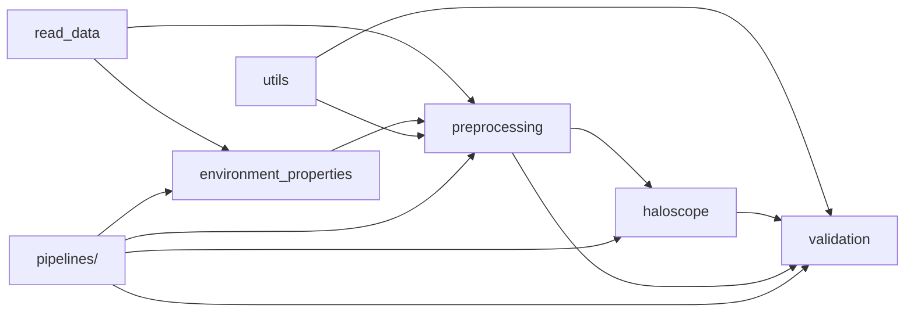
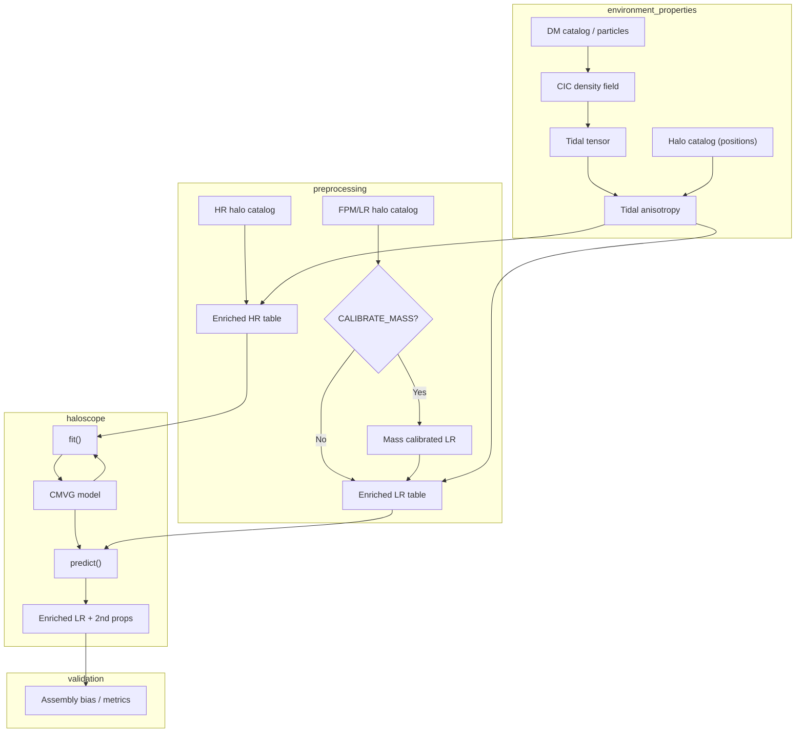

# Plan: nueva estructura del repositorio Haloscope

| Campo | Valor |
| --- | --- |
| Fecha | 2026-09-19 |
| Estado | S0–S2 completados; S6 parcial (2026-09-20) — S3–S5, S7 pendiente |
| Repo producto | `density_field_properties` |
| Repo notas | `phd-agents-toolkit` |
| Spec | [`docs/density_field_properties/haloscope-repo-structure/spec.md`](../../docs/density_field_properties/haloscope-repo-structure/spec.md) |
| Plan pipeline (fases 0–6) | [`2026-09-17-haloscope-pipeline-implementacion.md`](2026-09-17-haloscope-pipeline-implementacion.md) |
| Decisiones Fase 0 | [`2026-09-17-haloscope-phase0-decisions.md`](2026-09-17-haloscope-phase0-decisions.md) |

---

## 1. Objetivo

Reorganizar `density_field_properties` en **cinco capas de paquetes Python** más **orquestación explícita** (`pipelines/`, `scripts/`, `slurm/`), de forma que el flujo Haloscope SIM → FastPM sea reproducible, testeable por capas y alineado con el pipeline científico del Artículo I.

**Este plan define la estructura objetivo y el orden de migración.** No autoriza refactor inmediato: la implementación sigue el plan de fases 1–6 existente, integrando los renombrados cuando cada fase lo requiera.

---

## 2. Motivación

El código actual mezcla responsabilidades bajo `haloscope/sim_to_fastpm/` (I/O, preprocessing, fit, plots, assembly bias) y reparte el entorno entre `density_field/`, `tidal_tensor.py` y `halo_environment_descriptors/`. Eso dificulta:

- Ejecutar solo la parte de campos de entorno (CIC + tidal) sin Haloscope.
- Reutilizar readers y HMF fuera del pipeline env.
- Testear fit/predict sin catálogos de cluster.
- Cablear la variante tidal (Fase 3) sin duplicar lógica.

La nueva estructura separa **lectura**, **propiedades de entorno**, **preprocesado de halos**, **modelo Haloscope**, **utilidades/análisis** y **validación científica**.

---

## 3. Arquitectura objetivo

### 3.1 Capas y dependencias



**Regla:** las flechas van siempre hacia abajo. Ningún paquete de dominio importa `pipelines/`.

### 3.2 Flujo de datos (pipeline completo)



**Corrección respecto al boceto inicial:** la calibración de masa aplica al catálogo **LR** (FastPM), no al HR de entrenamiento. El HR alimenta la referencia del abundance matching.

---

## 4. Estructura de directorios objetivo

```text
density_field_properties/
├── config/
│   ├── haloscope_run.yaml
│   ├── environment_properties.yaml
│   └── paths_taurus.yaml              # rutas cluster; no hardcode en código
├── docs/                              # en repo producto: README + spec enlace
├── scripts/                           # CLIs delgados
├── slurm/
│   ├── environment_properties/
│   ├── preprocessing/
│   ├── haloscope/
│   └── validation/
├── pipelines/                         # orquestación; sin lógica de dominio
│   ├── run_environment_properties.py
│   ├── run_preprocessing.py
│   ├── run_haloscope_enrichment.py
│   └── run_validation.py
├── output/                            # gitignored
└── src/density_field_properties/
    ├── read_data/
    ├── environment_properties/
    ├── preprocessing/
    ├── haloscope/
    ├── utils/
    └── validation/
```

**Convención:** paquetes Python en `snake_case`. El nombre del repo **se mantiene** (`density_field_properties`) para no romper rutas Slurm/Taurus existentes.

Detalle de módulos, contratos y requisitos: ver **spec** enlazada arriba.

---

## 5. Descripción resumida de cada capa

| Capa | Responsabilidad | Origen principal (código actual) |
| --- | --- | --- |
| **read_data** | I/O de partículas DM y catálogos (Rockstar, FastPM, hlist) sin filtros científicos | `halo_catalog/`, `density_field/particle_io.py`, `cosmology.py` |
| **environment_properties** | CIC, tensor tidal, anisotropía tidal por halo | `density_field/cic_deposit.py`, `tidal_tensor.py`, `halo_environment_descriptors/` |
| **preprocessing** | Filtros, join entorno, calibración masa, schema tabla Haloscope | `sim_to_fastpm/load_catalogs.py`, `mass_matching.py`, `environment.py`, `tidal_features.py` |
| **haloscope** | CMVG vendored, fit por bin, predict | `haloscope/haloscope.py`, `sim_to_fastpm/training.py` |
| **utils** | HMF, plotting genérico, helpers numéricos | scripts HMF, `plotting.py` (parte genérica) |
| **validation** | Hold-out, marginales, assembly bias, P(k), informes | `assembly_bias.py`, futuro `validation.py` |
| **pipelines/** | Encadenar capas, YAML, manifests | `sim_to_fastpm/pipeline.py`, `pipeline_tidal.py` |

---

## 6. Mapa migración código actual → objetivo

| Ruta actual | Destino |
| --- | --- |
| `halo_catalog/*` | `read_data/halos/*` |
| `density_field/particle_io.py` | `read_data/particles/` |
| `density_field/cic_deposit.py`, `utils.py` | `environment_properties/cic/` |
| `density_field/fourrier_transformations.py` | `environment_properties/fourier/` |
| `tidal_tensor.py` | `environment_properties/tidal_tensor/` |
| `halo_environment_descriptors/tidal_anisotropy.py` | `environment_properties/tidal_anisotropy/` |
| `cosmology.py` | `read_data/cosmology.py` |
| `haloscope/haloscope.py` | `haloscope/model.py` |
| `sim_to_fastpm/training.py` | `haloscope/training.py` + `haloscope/predict.py` |
| `sim_to_fastpm/load_catalogs.py` | `read_data` + `preprocessing/filters.py` |
| `sim_to_fastpm/mass_matching.py` | `preprocessing/mass_calibration.py` |
| `sim_to_fastpm/environment.py` | `preprocessing/environment_join.py` |
| `sim_to_fastpm/tidal_features.py` | `preprocessing/environment_join.py` |
| `sim_to_fastpm/pipeline.py` | `pipelines/run_haloscope_enrichment.py` |
| `sim_to_fastpm/pipeline_tidal.py` | shim → `pipelines/haloscope_enrichment` + JSON tidal (eliminado `haloscope_enrichment_tidal.py`) |
| `sim_to_fastpm/assembly_bias.py` | `validation/assembly_bias.py` |
| `sim_to_fastpm/plotting.py` | `utils/plotting/` + `validation/` |
| `sim_to_fastpm/config.py` | `config/*.yaml` + loader en `pipelines/` |

---

## 7. Orquestación Slurm

| Job | Capa | Entrada | Salida |
| --- | --- | --- | --- |
| `main_density_field_cic.slurm` | environment_properties | snap DM | density + info |
| `main_tidal_tensor_field*.slurm` | environment_properties | density | tidal tensor |
| (nuevo) `main_preprocessing_*.slurm` | preprocessing | catálogo + env artefacts | Parquet HR/LR |
| `main_sim_to_fastpm_haloscope*.slurm` | haloscope | tablas preprocessed | Parquet enriquecido + modelos |
| (nuevo) `main_validation_*.slurm` | validation | enriquecido + referencia HR | PDFs, JSON métricas |

Cada job debe escribir un **`manifest.json`** (inputs, versiones, hashes) consumido por el siguiente paso. Detalle en spec §6.

---

## 8. Integración con el plan de fases 1–6

| Fase plan maestro | Trabajo de estructura |
| --- | --- |
| **Fase 1** (env production-ready) | Introducir `pipelines/run_haloscope_enrichment.py` como fachada; **no** renombrar paquetes aún. Implementar loader YAML (F1.2). |
| **Fase 2** (bins + HMF gate) | Mover lógica HMF diagnóstico a `utils/hmf/`; gate en `preprocessing/mass_calibration.py`. |
| **Fase 3** (tidal) | Unificar join en `preprocessing/environment_join.py`; artefactos tidal en `environment_properties/`. |
| **Fase 4** (ciencia) | Crear `validation/`; cablear assembly bias fuera de `haloscope/`. |
| **Fase 5** (docs) | README por capa; spec en repo producto apuntando a `phd-agents-toolkit/docs/`. |
| **Fase 6** (extensiones) | ML masa en `preprocessing/mass_calibration.py`; adapters downstream fuera de Haloscope. |

---

## 9. Fases de migración (estructura)

Migración **incremental** con shims de import deprecados un release.

| ID | Tarea | Riesgo | Depende de |
| --- | --- | --- | --- |
| S0 | Aprobar spec + este plan | — | — | ✅ 2026-09-20 |
| S1 | Crear `pipelines/` y mover orquestación desde `sim_to_fastpm/pipeline*.py` | Bajo | F1 smoke estable | ✅ 2026-09-20 |
| S2 | Extraer `preprocessing/` (mass, env join, filters) | Medio | S1 | ✅ 2026-09-20 |
| S3 | Renombrar `halo_catalog/` → `read_data/halos/` + shims | Medio | tests readers |
| S4 | Agrupar `environment_properties/` desde `density_field/` + tidal | Medio | Slurm CIC+tidal |
| S5 | Reducir `haloscope/` a model + training + predict | Bajo | S2 |
| S6 | Crear `validation/` y `utils/`; retirar assembly bias de sim_to_fastpm | Bajo | Fase 4 | 🔄 parcial 2026-09-20 |
| S7 | Eliminar shims y carpeta `sim_to_fastpm/` | Alto | S1–S6 + CI verde |

**Paralelo permitido:** S4 (entorno) puede avanzar en rama aparte mientras corre producción F1.7.

---

## 10. Decisiones de diseño

| Tema | Decisión | Alternativa descartada |
| --- | --- | --- |
| Nombre del repo | Mantener `density_field_properties` | Renombrar a `haloscope_pipeline` (fricción Taurus) |
| Paquete `validation/` | Crear aparte de `utils/` | Todo en `utils/` (cajón de sastre) |
| Haloscope upstream | Seguir vendoring `haloscope.py` | Pip git (opción documentada en README) |
| Config | JSON presets (`config/haloscope_run_*.json`) + loader `HaloscopeEnrichmentConfig`; objetivo YAML único (F1.2) | Duplicar defaults en `config.py`; flags CLI largos (`--tidal-preset`, …) |
| Artefactos | Parquet + manifest JSON entre steps | Recalcular entorno en cada predict |
| HR calibración masa | HR **no** pasa por abundance matching | Calibrar ambos catálogos |

---

## 11. Criterios de aceptación (estructura completa)

- [ ] Árbol §4 implementado; `sim_to_fastpm/` eliminado (S7).
- [ ] Dependencias respetan el grafo §3.1 (sin imports circulares).
- [ ] Cada capa tiene tests unitarios bajo `src/tests/<capa>/`.
- [ ] Smoke integración con fixtures sintéticos (F1.8) pasa sin rutas Taurus.
- [ ] Slurm jobs por capa con manifests encadenados.
- [ ] Spec R1–R20 verificada (ver documento spec).
- [ ] README repo producto describe flujo preflight → env → preprocess → haloscope → validation.
- [ ] Plan maestro fases 1–6 sigue siendo la fuente de verdad funcional; este plan solo gobierna **organización**.

---

## 12. Riesgos

| Riesgo | Mitigación |
| --- | --- |
| Big-bang rename rompe Slurm/Taurus | Migración S1–S7 incremental; shims de import |
| Duplicación temporal pipeline vs sim_to_fastpm | S1 fachada única; borrar legacy en S7 |
| `utils/` absorbe lógica de pipeline | Regla: pipeline logic → `preprocessing/` o `validation/` |
| Paths cluster hardcodeados | `config/paths_taurus.yaml` + variables en YAML run |

---

## 13. Documentos relacionados

| Documento | Rol |
| --- | --- |
| [`haloscope-repo-structure/spec.md`](../../docs/density_field_properties/haloscope-repo-structure/spec.md) | Requisitos, schemas, APIs por paquete |
| [`2026-09-17-haloscope-pipeline-implementacion.md`](2026-09-17-haloscope-pipeline-implementacion.md) | Fases funcionales 0–6 |
| [`2026-09-17-haloscope-phase0-decisions.md`](2026-09-17-haloscope-phase0-decisions.md) | Decisiones catálogo, ICs, HMF |
| `density_field_properties/config/haloscope_run.yaml` | Config 1ª corrida |

---

## 14. Historial

| Fecha | Cambio |
| --- | --- |
| 2026-09-19 | Plan creado; spec asociada; sin refactor en repo producto |
| 2026-09-20 | S0 aprobado por Santiago; S1 completado (`pipelines/`, shims en `sim_to_fastpm/pipeline*.py`) |
| 2026-09-20 | S2 completado (`preprocessing/`, shims en mass_matching/environment/tidal_features) |
| 2026-09-20 | S6 parcial: `validation/assembly_bias_panel.py`, `HaloscopeEnrichmentConfig` + JSON presets; pipeline único; eliminados wrappers tidal deprecados |
