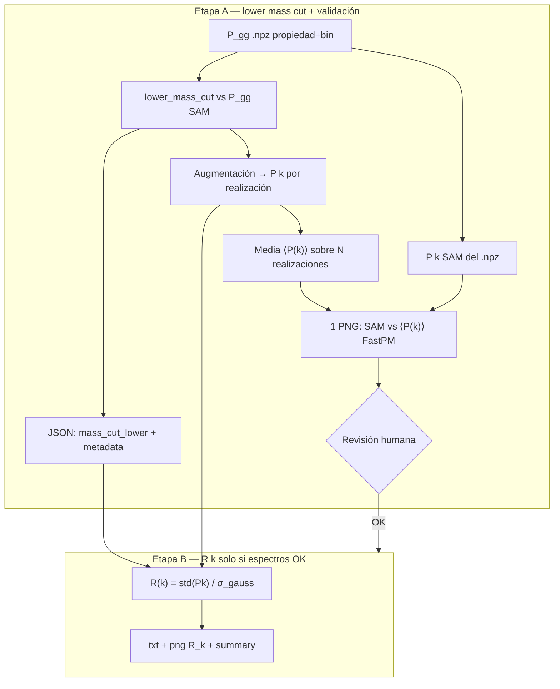
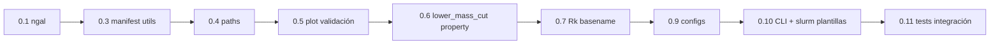

# Plan Cursor: R(k) con P_gg por propiedad (mstar / OII)

| Campo | Valor |
| --- | --- |
| Fecha | 2026-09-14 |
| Estado | Fase 0 implementada (rama `feature/pgg-error-bars-mstar-oii`) |
| Spec | [spec.md](../../../docs/fnl_matching_error_reduction/pgg-error-bars-mstar-oii/spec.md) |
| Repo de producto | `fnl_matching_error_reduction` |
| Rama | `feature/pgg-error-bars-mstar-oii` |
| Plan base | [2026-09-14-pgg-error-bars-mstar-oii.md](./2026-09-14-pgg-error-bars-mstar-oii.md) |
| Catálogo P_gg | [2026-09-14-pgg-error-bars-mstar-oii-catalog.md](./2026-09-14-pgg-error-bars-mstar-oii-catalog.md) |

## Objetivo

Calcular barras de error para los plots de b_φ a partir de los 96 P_gg
seleccionados (mstar y `log10_OII_lum`, bins 1º/3º/5º), en **dos etapas
secuenciales con validación intermedia**:

1. **Etapa A — lower mass cut + diagnóstico de espectros:** para cada entrada del
   manifest, obtener el `mass_cut_lower` óptimo y una **única gráfica** que
   compare el P(k) SAM del `.npz` con el **P(k) medio** de la muestra FastPM
   augmentada (promedio sobre realizaciones; **no** una curva por simulación N).
2. **Etapa B — reducción de varianza R(k):** solo tras confirmar que los
   espectros de la etapa A son correctos, calcular
   **R(k) = std(P(k)) / σ_gauss(P(k))** sobre el ensemble FastPM fnl=0 fixed.

El resultado final alimentará las barras de error de los plots de b_φ.

## Contexto de la petición original

1. Olivia/Miguel han generado P_gg por propiedad y bin en Taurus
   (`.../b_phi_priors/P_gg/`).
2. No hace falta calcular los 5 bins de cada propiedad: basta el **1º, 3º y 5º**
   para ver cómo evolucionan los errores.
3. Fase inicial: **mstar** y **OII**; `L_bol` queda pendiente.
4. Hay que cubrir **todos los redshifts** (8 tracers) y **galform + shark**.
5. Snapshots SAM (n) y redshifts confirmados:

| Tracer | n (iz) | z | a |
| --- | --- | --- | --- |
| QSO-6 | 65 | 3.037 | 0.2477 |
| QSO-5 | 74 | 2.308 | 0.3023 |
| QSO-4 | 81 | 1.833 | 0.353 |
| QSO | 87 | 1.48 | 0.4032 |
| ELG | 90 | 1.321 | 0.4309 |
| LRG3 | 98 | 0.9436 | 0.5145 |
| LRG2 | 104 | 0.7018 | 0.5876 |
| LRG1 | 109 | 0.5232 | 0.6565 |

Los valores **z** se usan en configs (`pipeline_run*.json`), nombres de salida y
Slurm. El índice **n** identifica el snapshot SAM de los P_gg de Olivia. El
pipeline FastPM usa catálogos fnl=0 en `fof_0.5000/LL-0.200` (independiente de
n; el matching es por tracer + z).

## Metodología elegida

### Por qué augmentación sintética (no matched por masa)

| Enfoque | Usa P_gg por propiedad | n_target por bin | Estado en repo |
| --- | --- | --- | --- |
| `run_matched_Rk_tracer` | No (usa `mass_bins_unit_*.json`) | Masa matched única | Implementado |
| `run_synthetic_augmentation_Rk_tracer` | **Sí** (`load_external_pgg` → `n_sam`) | **Por fichero P_gg** | Implementado, extensible |

Cada P_gg por propiedad tiene un **`ngal` distinto** (p. ej. LRG3 mstar bin bajo
≈ 4.6×10⁶ galaxias). La augmentación sintética escala la muestra FastPM al
`n_target` leído del P_gg concreto, que es lo que necesitamos.

### Flujo global (dos etapas)



**Criterio de la gráfica de validación (Etapa A):**

- **Línea SAM:** `k`, `pk` del `.npz` de Olivia (puntos, **sin** errorbars).
- **Línea FastPM:** **media** del P(k) augmentado sobre todas las realizaciones
  del ensemble fnl=0 (p. ej. ~50 sims), con `n_target = ngal` del NPZ.
- **Banda FastPM:** ±1σ entre realizaciones (`fill_between`), no curvas
  individuales por `fastpm_N*`.
- **No generar** 50 PNGs (uno por simulación); una sola figura por entrada del
  manifest.

**Nota:** el P_gg es fnl100 (SAM) pero el matching y R(k) usan FastPM **fnl=0**
fixed. Del NPZ de la etapa A usamos `k`, `pk`, `ngal` y bordes de bin; R(k) en
etapa B reutiliza el `mass_cut_lower` ya validado.

## Revisión de lectura de P_gg

Los NPZ de Olivia usan la clave **`ngal`** (no `n_gal`). El fix de lectura forma
parte de la **Fase 0** (tarea 0.1). La clave opcional **`err`** no se usa en el
pipeline: la PNG de validación no muestra incertidumbre SAM.

Sin cambios necesarios en formato `k`/`pk`/`shotnoise` ni en
`build_pgg_path(..., pgg_suffix=...)`.

## Extensiones de código propuestas

### 0. Etapa A — script de lower mass cut por P_gg de propiedad

Nuevo script:

`scripts/pipelines/run_lower_mass_cut_property_pgg.py`

Por cada fila del manifest (96 entradas):

1. Cargar P_gg NPZ (`k`, `pk`, `ngal`, `lower_edge`, `upper_edge`).
2. Ejecutar `optimize_lower_mass_cut_hierarchical_search` (o wrapper existente
   de `run_lower_mass_cut_matching`) usando **ese** P_gg como target.
3. Guardar JSON:

```text
output/lower_mass_cut_property_pgg/<Tracer>/<Sam>/
  lower_mass_cut_<prop>_<bin_lo>_<bin_hi>.json
```

Campos mínimos: `mass_cut_lower`, `n_sam` (= ngal), `pgg_path`, `object_type`,
`sam`, `z`, `property`, `bin_lo`, `bin_hi`, `matching_mode`.

4. Calcular P(k) augmentado en cada realización FastPM; **promediar** en k.
5. Guardar **una** PNG de validación:

```text
output/lower_mass_cut_property_pgg/<Tracer>/<Sam>/
  pk_validation_<prop>_<bin_lo>_<bin_hi>.png
```

Contenido: SAM (curva de puntos) vs ⟨P(k)⟩ FastPM augmentado + banda ±1σ del
ensemble. Estilo coherente con `plot_lower_mass_cut_pk_best_match`
(`SHARK_COLOR`, `FASTPM_COLOR`).

6. Escribir `lower_mass_cut_property_pgg_summary.json` agregado.

**Slurm Etapa A:** `slurm/pipelines/lower_mass_cut_property_pgg_array.slurm`
(`#SBATCH --array=1-96`).

**Revisión entre etapas:** decisión humana del grupo tras revisar PNGs; **sin**
gate automático en código (`validation_status.json` descartado).

### 1. Sufijo en nombres de salida R(k)

`build_Rk_basename` hoy devuelve `R_k_{Sam}_{Tracer}`. Para 96 jobs hace falta
desambiguar:

```text
R_k_Galform_LRG3_mstar_9p50000_9p69649.txt
R_k_Shark_ELG_log10_OII_lum_40p10221_40p56051.txt
```

**Archivo:** `pk_variance_reduction_Rk.py` — nuevo parámetro opcional
`property_suffix` en `build_Rk_basename`, `run_synthetic_augmentation_Rk_tracer`
y summary JSON.

### 2. Etapa B — script batch R(k) desde manifiesto

`scripts/pipelines/compute_pk_variance_reduction_Rk_property_pgg.py`

**Precondición:** existe el JSON de Etapa A para esa fila del manifest.

Entrada:

- `--manifest-csv` (copia en `configs/manifests/`)
- `--lower-mass-cut-property-dir` → `output/lower_mass_cut_property_pgg/`
- `--fastpm-path`, `--output-dir`, flags de augmentación

Lógica por fila:

1. Resolver `pgg_path` y `lower_mass_cut_json_path` (Etapa A, mismo slug).
2. Llamar a `run_synthetic_augmentation_Rk_tracer`.
3. Mergear `R_k_property_pgg_summary.json`.

CLI: `--job-id`, `--config-json`, `--n-sims` (piloto); overrides opcionales
`--manifest-csv`, `--lower-mass-cut-property-dir`.

### 3. Config JSON

`configs/pipeline_run_property_pgg_rk.json`:

```json
{
  "pk_variance_reduction_property_pgg": {
    "manifest_csv": "configs/manifests/pgg_mstar_oii_selected.csv",
    "fastpm_path": "/data8/adrian/fastpm_N2048_kmax0_25/fnl0",
    "pgg_base_dir": "/home/olivia/Miguel/GP_codes_SAM/clustering_and_bool_lumy/b_phi_priors/P_gg",
    "lower_mass_cut_dir": "output/lower_mass_cut",
    "output_dir": "output/pk_variance_reduction/property_pgg",
    "n_grid": 128,
    "k_max": 0.2,
    "fof_snapshot": "fof_0.5000",
    "fof_subdir": "LL-0.200",
    "with_replacement": true,
    "n_synthetic_draws": 1,
    "tracer_metadata": {
      "QSO-6": {"n": 65, "z": 3.037, "a": 0.2477},
      "QSO-5": {"n": 74, "z": 2.308, "a": 0.3023},
      "QSO-4": {"n": 81, "z": 1.833, "a": 0.353},
      "QSO":   {"n": 87, "z": 1.48,  "a": 0.4032},
      "ELG":   {"n": 90, "z": 1.321, "a": 0.4309},
      "LRG3":  {"n": 98, "z": 0.9436,"a": 0.5145},
      "LRG2":  {"n": 104,"z": 0.7018,"a": 0.5876},
      "LRG1":  {"n": 109,"z": 0.5232,"a": 0.6565}
    }
  }
}
```

Copiar el manifest CSV al repo de producto para que Slurm no dependa del toolkit.

### 4. Slurm

| Job | Script | Array | Cuándo |
| --- | --- | --- | --- |
| Etapa A | `lower_mass_cut_property_pgg_array.slurm` | `1-96` | Primero |
| Etapa B | `rk_property_pgg_mstar_oii_array.slurm` | `1-96` | Tras revisar PNGs (manual) |

Plantilla: `rk_elg_qso_fnl0.slurm` (16 cores, OMP=16).

## Dependencias previas

| Dependencia | Estado | Acción |
| --- | --- | --- |
| P_gg fnl100 por propiedad (96) | OK en Taurus | — |
| FastPM fnl=0 fixed | `/data8/adrian/fastpm_N2048_kmax0_25/fnl0` | Confirmar en Slurm |
| Redshifts z por tracer | Confirmados (tabla arriba) | Actualizar configs |
| `lower_mass_cut` legacy (sin propiedad) | Solo ELG local | **No reutilizar**; Etapa A genera JSON por P_gg |

## Plan de ejecución por fases

### Fase 0 — Infraestructura de código (previo a Etapa A y B)

Objetivo: dejar el repo listo para ejecutar el flujo completo sin improvisar
paths, lecturas NPZ ni nombres de salida. **Ningún job Slurm de producción**
hasta cerrar los criterios de esta fase.

Orden recomendado de implementación (cada bloque con tests antes del siguiente):



---

#### 0.1 — Lectura NPZ: clave `ngal`

| | |
| --- | --- |
| **Archivo** | `src/fnl_matching/matching/engine.py` → `_load_pgg_npz` |
| **Cambio** | Aceptar `n_gal` **o** `ngal`; fallback a `box_size³/shotnoise` solo si faltan ambas. |
| **Tests** | `src/tests/pipelines/test_match_bins.py` (junto a tests NPZ existentes) o `src/tests/matching/test_engine.py`: fixture con `ngal=4591211` y assert del valor leído, no el inferido. |

```python
if "n_gal" in archive.files:
    ngal = int(archive["n_gal"])
elif "ngal" in archive.files:
    ngal = int(archive["ngal"])
else:
    ngal = int(box_size**3 / shotnoise)
```

---

#### 0.2 — Lectura NPZ: barras de error SAM (`err`) — **descartado**

No implementado. La PNG de validación usa solo curva SAM + media/banda FastPM;
`load_external_pgg` existente basta para matching y R(k).

---

#### 0.3 — Utilidades de manifiesto

| | |
| --- | --- |
| **Archivo nuevo** | `src/fnl_matching/pipelines/property_pgg_manifest.py` |
| **Funciones** | `load_manifest_csv(path) -> list[dict]`; `normalize_sam_label(sam) -> str` (`galform`→`Galform`, `shark`→`Shark`); `extract_pgg_suffix(filename) -> str` (parte tras `_galform_`/`_shark_` sin `.npz`); `build_property_slug(property_key, bin_lo_fmt, bin_hi_fmt) -> str`; `resolve_tracer_z(object_type, tracer_metadata) -> float`. |
| **Constante** | `TRACER_METADATA` con tabla z/n/a confirmada (importable desde config JSON en runtime). |
| **Tests** | `src/tests/pipelines/test_property_pgg_manifest.py`: parsear 2–3 filas del CSV real; normalización SAM; suffix de `P_gg_LRG3_fnl100_galform_mstar_9p50000_9p69649.npz`. |

---

#### 0.4 — Paths de salida por propiedad+bin

| | |
| --- | --- |
| **Archivo** | `src/fnl_matching/pipelines/pipeline_paths.py` |
| **Funciones nuevas** | `build_property_pgg_output_dir(base, object_type, sam) -> str`; `build_lower_mass_cut_property_json_path(dir, property_slug) -> str`; `build_pk_validation_plot_path(dir, property_slug) -> str`; `build_rk_property_output_path(dir, sam, object_type, property_slug) -> str`. |
| **Convención slug** | `{property_key}_{bin_lo_fmt}_{bin_hi_fmt}` (p. ej. `mstar_9p50000_9p69649`). |
| **Tests** | Rutas estables y sin colisiones entre dos bins del mismo tracer. |

---

#### 0.5 — Gráfica de validación: SAM vs ⟨P(k)⟩ FastPM

| | |
| --- | --- |
| **Archivo nuevo** | `src/fnl_matching/pipelines/property_pgg_validation.py` |
| **Función principal** | `plot_sam_vs_mean_augmented_pk(k_sam, pk_sam, k_fastpm, pk_fastpm_mean, pk_fastpm_std, output_path, metadata)` |
| **Comportamiento** | SAM como puntos (sin errorbars); curva FastPM media; banda ±1σ opcional; **no** PNG por realización. |
| **Cálculo P(k) medio** | Reutilizar `stack_synthetic_augmented_pk_ensemble` de `pk_variance_reduction_Rk.py`; promediar filas de `pk_matrix` en axis=0; std para banda. |
| **Estilo** | Colores/labels coherentes con `plot_lower_mass_cut_pk_best_match` (`SHARK_COLOR`, `FASTPM_COLOR`). |
| **Tests** | Smoke test con arrays sintéticos de 5 k-modes; comprobar que el PNG se crea y tiene tamaño > 0. |

---

#### 0.6 — Orquestador Etapa A (lower mass cut por P_gg)

| | |
| --- | --- |
| **Archivo nuevo** | `src/fnl_matching/pipelines/lower_mass_cut_property_pgg.py` |
| **Función** | `run_lower_mass_cut_property_pgg(entry, config) -> dict` |
| **Flujo** | 1) `load_external_pgg`; 2) `run_lower_mass_cut_matching` con slug de propiedad (`output_basename_slug`, sin plots legacy); 3) ensemble augmentado → media P(k); 4) `plot_sam_vs_mean_augmented_pk`; 5) summary. |
| **Ajuste en** | `lower_mass_cut_matching.py`: `output_basename_slug` y `write_legacy_plots=False` para flujo property P_gg. |
| **Script CLI** | `scripts/pipelines/run_lower_mass_cut_property_pgg.py` con `--config-json`, `--job-id`, `--n-sims` (piloto); override `--manifest-csv`. |
| **Tests** | Mock de `optimize_lower_mass_cut` + mock ensemble; verificar paths de salida y campos del JSON (`mass_cut_lower`, `pgg_path`, `property`, `bin_lo`, `bin_hi`, `ngal`). |

---

#### 0.7 — Sufijos en salida R(k) (Etapa B)

| | |
| --- | --- |
| **Archivo** | `src/fnl_matching/pipelines/pk_variance_reduction_Rk.py` |
| **Cambio** | `build_Rk_basename(sam_type, object_type, property_suffix=None)`; si `property_suffix` presente → `R_k_{Sam}_{Tracer}_{suffix}`. Propagar a `run_synthetic_augmentation_Rk_tracer` y summary JSON. |
| **Tests** | Actualizar tests existentes de `build_Rk_basename`; caso con suffix no vacío. |

---

#### 0.8 — Gate de validación Etapa A → B — **descartado**

No implementado. La Etapa B comprueba solo que exista el JSON de Etapa A; la
aprobación de espectros es revisión manual del grupo, no automatizada en repo.

---

#### 0.9 — Configuración y manifiesto en el repo de producto

| | |
| --- | --- |
| **Copiar** | `configs/manifests/pgg_mstar_oii_selected.csv` (96 filas desde toolkit) |
| **Crear** | `configs/pipeline_run_property_pgg_rk.json` con bloques `lower_mass_cut_property_pgg` y `pk_variance_reduction_property_pgg`, `tracer_metadata` (tabla z/n/a), paths Taurus. |
| **Crear** | `output/lower_mass_cut_property_pgg/.gitkeep` o documentar en README que la carpeta se crea en runtime. |

---

#### 0.10 — CLI central y plantillas Slurm

| | |
| --- | --- |
| **Modificar** | `scripts/pipelines/run_pipelines.py`: flags `--lower-mass-cut-property-pgg` y `--pk-variance-reduction-property-pgg`. |
| **Crear** | `scripts/pipelines/compute_pk_variance_reduction_Rk_property_pgg.py` (Etapa B por `--job-id`). |
| **Crear** | `slurm/pipelines/lower_mass_cut_property_pgg_array.slurm` (`#SBATCH --array=1-96`) |
| **Crear** | `slurm/pipelines/rk_property_pgg_mstar_oii_array.slurm` (`#SBATCH --array=1-96`) |

---

#### 0.11 — Tests de integración y pre-commit

| | |
| --- | --- |
| **Suite** | `pytest src/tests/pipelines/test_property_pgg_manifest.py src/tests/pipelines/test_lower_mass_cut_property_pgg.py` (+ tests 0.1, 0.7) |
| **Pre-commit** | Pasar en todos los ficheros tocados. |

---

#### Criterios de cierre Fase 0

- [x] **0.1** `ngal` leído correctamente de NPZ de Olivia.
- [x] **0.2** Descartado (sin errorbars SAM en PNG).
- [x] **0.3–0.4** Manifest parseado; paths deterministas por job_id.
- [x] **0.5** Función de plot genera 1 PNG (SAM puntos + media/banda FastPM).
- [x] **0.6** Orquestador Etapa A con `--n-sims` para piloto.
- [x] **0.7** `build_Rk_basename` con suffix; tests verdes.
- [x] **0.8** Descartado (sin gate automático).
- [x] **0.9** CSV + JSON de config en repo de producto.
- [x] **0.10** Slurm plantillas + flags en `run_pipelines.py`.
- [x] **0.11** `pytest` y pre-commit en verde para el alcance de Fase 0.

**Entregable:** PR en `feature/pgg-error-bars-mstar-oii` con la infraestructura;
**sin** lanzar los 96 jobs de producción (eso es Fase 2/3).

---

### Fase 1 — Piloto Etapa A (LRG3, 6 jobs)

| job_id | P_gg |
| --- | --- |
| 25–27 | `P_gg_LRG3_fnl100_galform_mstar_*` |
| 31–33 | `P_gg_LRG3_fnl100_shark_mstar_*` |

Revisar manualmente las 6 PNG: forma del P(k), ratio SAM/FastPM, `mass_cut_lower`
razonable.

### Fase 2 — Etapa A completa (96 jobs)

Array Slurm → 96 JSON + 96 PNG de validación. Revisión por el grupo.

### Fase 3 — Etapa B (96 jobs R(k))

Tras revisión manual de PNGs de Etapa A. El script y Slurm de Etapa B están en
Fase 0 (0.10); aquí se **ejecuta** el batch completo.

### Fase 4 — Integración en plots

- Propagar R(k) al fit de b_φ con `pgg_suffix` por propiedad/bin.
- Extender a `L_bol` cuando estén los bins nuevos.

## Estimación de cómputo

| Parámetro | Valor típico |
| --- | --- |
| Realizaciones FastPM | ~50 |
| n_grid | 128 |
| Jobs | 96 |
| Cores/job | 16 |

Orden de magnitud: **decenas de horas de CPU** si se lanza secuencialmente;
con `--array=1-96` y límite de jobs concurrentes del cluster, acotar a días.

Recomendación: piloto con `--n-sims 5` en desarrollo; producción con detección
automática.

## Estructura de salida

### Etapa A

```text
output/lower_mass_cut_property_pgg/
  lower_mass_cut_property_pgg_summary.json
  LRG3/Galform/
    lower_mass_cut_mstar_9p50000_9p69649.json
    pk_validation_mstar_9p50000_9p69649.png    # SAM vs ⟨P(k)⟩ FastPM
    ...
```

### Etapa B

```text
output/pk_variance_reduction/property_pgg/
  R_k_property_pgg_summary.json
  LRG3/
    R_k_Galform_LRG3_mstar_9p50000_9p69649.txt
    R_k_Galform_LRG3_mstar_9p50000_9p69649.png
    ...
```

## Criterios de aceptación

**Etapa A**

- [ ] `_load_pgg_npz` lee `ngal` sin inferencia incorrecta.
- [ ] Por cada entrada del manifest: JSON con `mass_cut_lower` + 1 PNG SAM vs ⟨P(k)⟩.
- [ ] No se escriben PNGs por realización FastPM individual.
- [ ] Piloto LRG3 (6 jobs) revisado y aprobado.

**Etapa B**

- [ ] Etapa B exige JSON de Etapa A por job (`FileNotFoundError` si falta).
- [ ] 96 txt/png R(k) + summary JSON.
- [ ] Tests pytest en verde.

## Riesgos y mitigaciones

| Riesgo | Mitigación |
| --- | --- |
| Etapa B antes de revisar espectros | Proceso manual del grupo; no lanzar Slurm B hasta OK |
| Tiempos Slurm (96 × N realizaciones × 2 etapas) | Arrays; piloto con `n_sims=5` |
| `galform` vs `Galform` en paths | Normalizar al resolver JSON |
| Mass cut distinto por bin de propiedad | Un JSON por entrada manifest (96) |

## Archivos a crear/modificar (repo de producto)

Resumen alineado con Fase 0 (ver tareas 0.1–0.11 para detalle):

| Acción | Ruta | Fase 0 tarea |
| --- | --- | --- |
| Modificar | `src/fnl_matching/matching/engine.py` | 0.1 |
| Modificar | `src/fnl_matching/pipelines/lower_mass_cut_matching.py` | 0.6 |
| Modificar | `src/fnl_matching/pipelines/pk_variance_reduction_Rk.py` | 0.7 |
| Modificar | `src/fnl_matching/pipelines/pipeline_paths.py` | 0.4 |
| Modificar | `scripts/pipelines/run_pipelines.py` | 0.10 |
| Crear | `src/fnl_matching/pipelines/property_pgg_manifest.py` | 0.3 |
| Crear | `src/fnl_matching/pipelines/property_pgg_validation.py` | 0.5 |
| Crear | `src/fnl_matching/pipelines/lower_mass_cut_property_pgg.py` | 0.6 |
| Crear | `scripts/pipelines/run_lower_mass_cut_property_pgg.py` | 0.6 |
| Crear | `scripts/pipelines/compute_pk_variance_reduction_Rk_property_pgg.py` | 0.10 |
| Crear | `configs/manifests/pgg_mstar_oii_selected.csv` | 0.9 |
| Crear | `configs/pipeline_run_property_pgg_rk.json` | 0.9 |
| Crear | `slurm/pipelines/lower_mass_cut_property_pgg_array.slurm` | 0.10 |
| Crear | `slurm/pipelines/rk_property_pgg_mstar_oii_array.slurm` | 0.10 |
| Crear | `src/tests/pipelines/test_property_pgg_manifest.py` | 0.3 |
| Crear | `src/tests/pipelines/test_lower_mass_cut_property_pgg.py` | 0.6 |
| Modificar | `src/tests/pipelines/test_match_bins.py` | 0.1 |

## Notas de sesión

- **2026-09-14:** Plan inicial (R(k), manifest, `ngal`).
- **2026-09-14:** Redshifts z/n/a confirmados; flujo en dos etapas con validación
  de espectros (1 PNG medio SAM vs FastPM por P_gg, sin curvas por simulación N).
- **2026-09-14:** Fase 0 detallada (0.1–0.11): infraestructura de código previa a
  cualquier batch Slurm; fix `ngal`, manifest utils, plot validación, configs.
- **2026-09-14:** Fase 0 implementada; descartados errorbars SAM (`err`), `--dry-run`
  y gate `validation_status.json` / `--require-validation-passed`.

## Resultado

Fase 0 mergeable en rama `feature/pgg-error-bars-mstar-oii`. Pendiente: piloto
Etapa A (Fase 1), batch 96 jobs y Etapa B.
